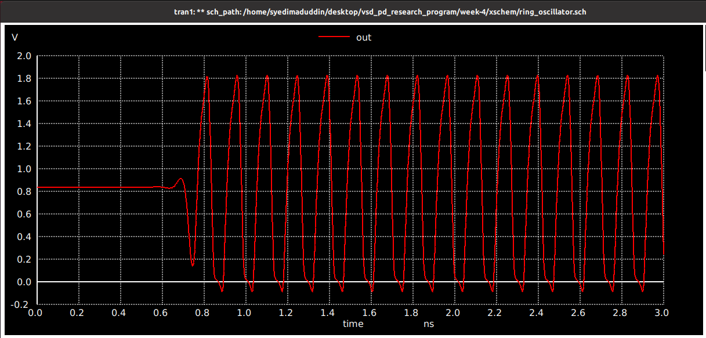

## Ring oscillator circuit desing in Xschem

A ring oscillator is a self-toggling circuit that generates clock-like pulses without any external input, other than the power that it needs. This is created by cascading inverters back to back in odd numbers (so that the next output is different than the previous). Following figure shows the design of a 3-stage ring oscillator created in **Xschem**. 


The netlist extracted from xschem for ring oscillator is given below 

```
** sch_path: /home/syedimaduddin/Desktop/VSD_PD_Research_Program/Week-4/xschem/ring_oscillator.sch
**.subckt ring_oscillator
XM1 net1 out GND GND sky130_fd_pr__nfet_01v8 L=0.15 W=1 nf=1 ad='int((nf+1)/2) * W/nf * 0.29' as='int((nf+2)/2) * W/nf * 0.29'
+ pd='2*int((nf+1)/2) * (W/nf + 0.29)' ps='2*int((nf+2)/2) * (W/nf + 0.29)' nrd='0.29 / W' nrs='0.29 / W'
+ sa=0 sb=0 sd=0 mult=1 m=1
XM2 net2 net1 GND GND sky130_fd_pr__nfet_01v8 L=0.15 W=1 nf=1 ad='int((nf+1)/2) * W/nf * 0.29' as='int((nf+2)/2) * W/nf * 0.29'
+ pd='2*int((nf+1)/2) * (W/nf + 0.29)' ps='2*int((nf+2)/2) * (W/nf + 0.29)' nrd='0.29 / W' nrs='0.29 / W'
+ sa=0 sb=0 sd=0 mult=1 m=1
XM3 out net2 GND GND sky130_fd_pr__nfet_01v8 L=0.15 W=1 nf=1 ad='int((nf+1)/2) * W/nf * 0.29' as='int((nf+2)/2) * W/nf * 0.29'
+ pd='2*int((nf+1)/2) * (W/nf + 0.29)' ps='2*int((nf+2)/2) * (W/nf + 0.29)' nrd='0.29 / W' nrs='0.29 / W'
+ sa=0 sb=0 sd=0 mult=1 m=1
XM4 net1 out VDD VDD sky130_fd_pr__pfet_01v8 L=0.15 W=1 nf=1 ad='int((nf+1)/2) * W/nf * 0.29' as='int((nf+2)/2) * W/nf * 0.29'
+ pd='2*int((nf+1)/2) * (W/nf + 0.29)' ps='2*int((nf+2)/2) * (W/nf + 0.29)' nrd='0.29 / W' nrs='0.29 / W'
+ sa=0 sb=0 sd=0 mult=1 m=1
XM5 net2 net1 VDD VDD sky130_fd_pr__pfet_01v8 L=0.15 W=1 nf=1 ad='int((nf+1)/2) * W/nf * 0.29' as='int((nf+2)/2) * W/nf * 0.29'
+ pd='2*int((nf+1)/2) * (W/nf + 0.29)' ps='2*int((nf+2)/2) * (W/nf + 0.29)' nrd='0.29 / W' nrs='0.29 / W'
+ sa=0 sb=0 sd=0 mult=1 m=1
XM6 out net2 VDD VDD sky130_fd_pr__pfet_01v8 L=0.15 W=1 nf=1 ad='int((nf+1)/2) * W/nf * 0.29' as='int((nf+2)/2) * W/nf * 0.29'
+ pd='2*int((nf+1)/2) * (W/nf + 0.29)' ps='2*int((nf+2)/2) * (W/nf + 0.29)' nrd='0.29 / W' nrs='0.29 / W'
+ sa=0 sb=0 sd=0 mult=1 m=1
Vdd VDD GND 1.8
.save i(vdd)
**** begin user architecture code
.lib /usr/local/share/pdk/sky130A/libs.tech/ngspice/sky130.lib.spice tt
.tran 1p 3n 0
.control
  run
  print allv > plot_data_v.txt
  print alli > plot_data_i.txt
  plot v(out)
.endc
.save all
**** end user architecture code
**.ends
.GLOBAL VDD
.GLOBAL GND
.end
```

Running the simulation for 3ns with a 1ps steps, we get the following output waveform. 



<br><br>

## Generating layout for ring oscillator using ALIGN

We can then move on to generating the layout for the ring oscillator using ALIGN layout tool. The first thing that we need to do is to modify the netlist that we got from Xschem into the following. The edited netlist is given below

```
.subckt ring_oscillator out GND VDD
XM1 net1 out GND GND sky130_fd_pr__nfet_01v8 L=150e-9 W=10.5e-7 nf=10 m=1
XM2 net2 net1 GND GND sky130_fd_pr__nfet_01v8 L=150e-9 W=10.5e-7 nf=10 m=1
XM3 out net2 GND GND sky130_fd_pr__nfet_01v8 L=150e-9 W=10.5e-7 nf=10 m=1
XM4 net1 out VDD VDD sky130_fd_pr__pfet_01v8 L=150e-9 W=21e-7 nf=10 m=1
XM5 net2 net1 VDD VDD sky130_fd_pr__pfet_01v8 L=150e-9 W=21e-7 nf=10 m=1
XM6 out net2 VDD VDD sky130_fd_pr__pfet_01v8 L=150e-9 W=21e-7 nf=10 m=1
.ends ring_oscillator
```

Then, we have to save this new netlist with the **.sp** extension. For this, I am saving it as ring_oscillator.sp. 

Then, we can run the ALIGN layout generator using the following command.

```
# schematic2layout.py /path_to_ring-oscillator_folder -p /path_to_pdk 
schematic2layout.py ../ALIGN-pdk-sky130/examples/ring_oscillator -p ../pdks/SKY130_PDK/
```

The run log can be seen in the image below. 


Now, we get gds file of ring oscillator layout and it will be opened in Magic by clicking on File -> Read GDS. The layout generated from Align tool is shown below.


When we extract the spice netlist, using the below commands: 

```
extract all
ext2spice cthresh 0 rthresh 0
ext2spice
```

Then, we get this netlist

```
* SPICE3 file created from RING_OSCILLATOR_0.ext - technology: sky130A

X0 m1_828_1568# STAGE2_INV_7811550_0_0_1677679601_0/li_1179_1495# GND GND sky130_fd_pr__nfet_01v8 ad=1.47e+12p pd=1.33e+07u as=5.1975e+12p ps=4.77e+07u w=1.05e+06u l=150000u
X1 m1_828_1568# STAGE2_INV_7811550_0_0_1677679601_0/li_1179_1495# GND GND sky130_fd_pr__nfet_01v8 ad=0p pd=0u as=0p ps=0u w=1.05e+06u l=150000u
X2 GND STAGE2_INV_7811550_0_0_1677679601_0/li_1179_1495# m1_828_1568# GND sky130_fd_pr__nfet_01v8 ad=0p pd=0u as=0p ps=0u w=1.05e+06u l=150000u
X3 GND STAGE2_INV_7811550_0_0_1677679601_0/li_1179_1495# m1_828_1568# GND sky130_fd_pr__nfet_01v8 ad=0p pd=0u as=0p ps=0u w=1.05e+06u l=150000u
X4 m1_828_1568# STAGE2_INV_7811550_0_0_1677679601_0/li_1179_1495# GND GND sky130_fd_pr__nfet_01v8 ad=0p pd=0u as=0p ps=0u w=1.05e+06u l=150000u
X5 m1_828_1568# STAGE2_INV_7811550_0_0_1677679601_0/li_1179_1495# GND GND sky130_fd_pr__nfet_01v8 ad=0p pd=0u as=0p ps=0u w=1.05e+06u l=150000u
X6 GND STAGE2_INV_7811550_0_0_1677679601_0/li_1179_1495# m1_828_1568# GND sky130_fd_pr__nfet_01v8 ad=0p pd=0u as=0p ps=0u w=1.05e+06u l=150000u
X7 m1_828_1568# STAGE2_INV_7811550_0_0_1677679601_0/li_1179_1495# GND GND sky130_fd_pr__nfet_01v8 ad=0p pd=0u as=0p ps=0u w=1.05e+06u l=150000u
X8 GND STAGE2_INV_7811550_0_0_1677679601_0/li_1179_1495# m1_828_1568# GND sky130_fd_pr__nfet_01v8 ad=0p pd=0u as=0p ps=0u w=1.05e+06u l=150000u
X9 GND STAGE2_INV_7811550_0_0_1677679601_0/li_1179_1495# m1_828_1568# GND sky130_fd_pr__nfet_01v8 ad=0p pd=0u as=0p ps=0u w=1.05e+06u l=150000u
X10 STAGE2_INV_7811550_0_0_1677679601_0/li_1179_1495# OUT GND GND sky130_fd_pr__nfet_01v8 ad=1.47e+12p pd=1.33e+07u as=0p ps=0u w=1.05e+06u l=150000u
X11 STAGE2_INV_7811550_0_0_1677679601_0/li_1179_1495# OUT GND GND sky130_fd_pr__nfet_01v8 ad=0p pd=0u as=0p ps=0u w=1.05e+06u l=150000u
X12 GND OUT STAGE2_INV_7811550_0_0_1677679601_0/li_1179_1495# GND sky130_fd_pr__nfet_01v8 ad=0p pd=0u as=0p ps=0u w=1.05e+06u l=150000u
X13 GND OUT STAGE2_INV_7811550_0_0_1677679601_0/li_1179_1495# GND sky130_fd_pr__nfet_01v8 ad=0p pd=0u as=0p ps=0u w=1.05e+06u l=150000u
X14 STAGE2_INV_7811550_0_0_1677679601_0/li_1179_1495# OUT GND GND sky130_fd_pr__nfet_01v8 ad=0p pd=0u as=0p ps=0u w=1.05e+06u l=150000u
X15 STAGE2_INV_7811550_0_0_1677679601_0/li_1179_1495# OUT GND GND sky130_fd_pr__nfet_01v8 ad=0p pd=0u as=0p ps=0u w=1.05e+06u l=150000u
X16 GND OUT STAGE2_INV_7811550_0_0_1677679601_0/li_1179_1495# GND sky130_fd_pr__nfet_01v8 ad=0p pd=0u as=0p ps=0u w=1.05e+06u l=150000u
X17 STAGE2_INV_7811550_0_0_1677679601_0/li_1179_1495# OUT GND GND sky130_fd_pr__nfet_01v8 ad=0p pd=0u as=0p ps=0u w=1.05e+06u l=150000u
X18 GND OUT STAGE2_INV_7811550_0_0_1677679601_0/li_1179_1495# GND sky130_fd_pr__nfet_01v8 ad=0p pd=0u as=0p ps=0u w=1.05e+06u l=150000u
X19 GND OUT STAGE2_INV_7811550_0_0_1677679601_0/li_1179_1495# GND sky130_fd_pr__nfet_01v8 ad=0p pd=0u as=0p ps=0u w=1.05e+06u l=150000u
X20 m1_828_1568# STAGE2_INV_7811550_0_0_1677679601_0/li_1179_1495# VDD VDD sky130_fd_pr__pfet_01v8 ad=2.94e+12p pd=2.38e+07u as=1.0395e+13p ps=8.55e+07u w=2.1e+06u l=150000u
X21 VDD STAGE2_INV_7811550_0_0_1677679601_0/li_1179_1495# m1_828_1568# VDD sky130_fd_pr__pfet_01v8 ad=0p pd=0u as=0p ps=0u w=2.1e+06u l=150000u
X22 VDD STAGE2_INV_7811550_0_0_1677679601_0/li_1179_1495# m1_828_1568# VDD sky130_fd_pr__pfet_01v8 ad=0p pd=0u as=0p ps=0u w=2.1e+06u l=150000u
X23 m1_828_1568# STAGE2_INV_7811550_0_0_1677679601_0/li_1179_1495# VDD VDD sky130_fd_pr__pfet_01v8 ad=0p pd=0u as=0p ps=0u w=2.1e+06u l=150000u
X24 m1_828_1568# STAGE2_INV_7811550_0_0_1677679601_0/li_1179_1495# VDD VDD sky130_fd_pr__pfet_01v8 ad=0p pd=0u as=0p ps=0u w=2.1e+06u l=150000u
X25 VDD STAGE2_INV_7811550_0_0_1677679601_0/li_1179_1495# m1_828_1568# VDD sky130_fd_pr__pfet_01v8 ad=0p pd=0u as=0p ps=0u w=2.1e+06u l=150000u
X26 VDD STAGE2_INV_7811550_0_0_1677679601_0/li_1179_1495# m1_828_1568# VDD sky130_fd_pr__pfet_01v8 ad=0p pd=0u as=0p ps=0u w=2.1e+06u l=150000u
X27 m1_828_1568# STAGE2_INV_7811550_0_0_1677679601_0/li_1179_1495# VDD VDD sky130_fd_pr__pfet_01v8 ad=0p pd=0u as=0p ps=0u w=2.1e+06u l=150000u
X28 m1_828_1568# STAGE2_INV_7811550_0_0_1677679601_0/li_1179_1495# VDD VDD sky130_fd_pr__pfet_01v8 ad=0p pd=0u as=0p ps=0u w=2.1e+06u l=150000u
X29 VDD STAGE2_INV_7811550_0_0_1677679601_0/li_1179_1495# m1_828_1568# VDD sky130_fd_pr__pfet_01v8 ad=0p pd=0u as=0p ps=0u w=2.1e+06u l=150000u
X30 STAGE2_INV_7811550_0_0_1677679601_0/li_1179_1495# OUT VDD VDD sky130_fd_pr__pfet_01v8 ad=2.94e+12p pd=2.38e+07u as=0p ps=0u w=2.1e+06u l=150000u
X31 VDD OUT STAGE2_INV_7811550_0_0_1677679601_0/li_1179_1495# VDD sky130_fd_pr__pfet_01v8 ad=0p pd=0u as=0p ps=0u w=2.1e+06u l=150000u
X32 VDD OUT STAGE2_INV_7811550_0_0_1677679601_0/li_1179_1495# VDD sky130_fd_pr__pfet_01v8 ad=0p pd=0u as=0p ps=0u w=2.1e+06u l=150000u
X33 STAGE2_INV_7811550_0_0_1677679601_0/li_1179_1495# OUT VDD VDD sky130_fd_pr__pfet_01v8 ad=0p pd=0u as=0p ps=0u w=2.1e+06u l=150000u
X34 STAGE2_INV_7811550_0_0_1677679601_0/li_1179_1495# OUT VDD VDD sky130_fd_pr__pfet_01v8 ad=0p pd=0u as=0p ps=0u w=2.1e+06u l=150000u
X35 VDD OUT STAGE2_INV_7811550_0_0_1677679601_0/li_1179_1495# VDD sky130_fd_pr__pfet_01v8 ad=0p pd=0u as=0p ps=0u w=2.1e+06u l=150000u
X36 VDD OUT STAGE2_INV_7811550_0_0_1677679601_0/li_1179_1495# VDD sky130_fd_pr__pfet_01v8 ad=0p pd=0u as=0p ps=0u w=2.1e+06u l=150000u
X37 STAGE2_INV_7811550_0_0_1677679601_0/li_1179_1495# OUT VDD VDD sky130_fd_pr__pfet_01v8 ad=0p pd=0u as=0p ps=0u w=2.1e+06u l=150000u
X38 STAGE2_INV_7811550_0_0_1677679601_0/li_1179_1495# OUT VDD VDD sky130_fd_pr__pfet_01v8 ad=0p pd=0u as=0p ps=0u w=2.1e+06u l=150000u
X39 VDD OUT STAGE2_INV_7811550_0_0_1677679601_0/li_1179_1495# VDD sky130_fd_pr__pfet_01v8 ad=0p pd=0u as=0p ps=0u w=2.1e+06u l=150000u
X40 OUT m1_828_1568# VDD VDD sky130_fd_pr__pfet_01v8 ad=2.94e+12p pd=2.38e+07u as=0p ps=0u w=2.1e+06u l=150000u
X41 VDD m1_828_1568# OUT VDD sky130_fd_pr__pfet_01v8 ad=0p pd=0u as=0p ps=0u w=2.1e+06u l=150000u
X42 VDD m1_828_1568# OUT VDD sky130_fd_pr__pfet_01v8 ad=0p pd=0u as=0p ps=0u w=2.1e+06u l=150000u
X43 OUT m1_828_1568# VDD VDD sky130_fd_pr__pfet_01v8 ad=0p pd=0u as=0p ps=0u w=2.1e+06u l=150000u
X44 OUT m1_828_1568# VDD VDD sky130_fd_pr__pfet_01v8 ad=0p pd=0u as=0p ps=0u w=2.1e+06u l=150000u
X45 VDD m1_828_1568# OUT VDD sky130_fd_pr__pfet_01v8 ad=0p pd=0u as=0p ps=0u w=2.1e+06u l=150000u
X46 VDD m1_828_1568# OUT VDD sky130_fd_pr__pfet_01v8 ad=0p pd=0u as=0p ps=0u w=2.1e+06u l=150000u
X47 OUT m1_828_1568# VDD VDD sky130_fd_pr__pfet_01v8 ad=0p pd=0u as=0p ps=0u w=2.1e+06u l=150000u
X48 OUT m1_828_1568# VDD VDD sky130_fd_pr__pfet_01v8 ad=0p pd=0u as=0p ps=0u w=2.1e+06u l=150000u
X49 VDD m1_828_1568# OUT VDD sky130_fd_pr__pfet_01v8 ad=0p pd=0u as=0p ps=0u w=2.1e+06u l=150000u
X50 OUT m1_828_1568# GND GND sky130_fd_pr__nfet_01v8 ad=1.47e+12p pd=1.33e+07u as=0p ps=0u w=1.05e+06u l=150000u
X51 OUT m1_828_1568# GND GND sky130_fd_pr__nfet_01v8 ad=0p pd=0u as=0p ps=0u w=1.05e+06u l=150000u
X52 GND m1_828_1568# OUT GND sky130_fd_pr__nfet_01v8 ad=0p pd=0u as=0p ps=0u w=1.05e+06u l=150000u
X53 GND m1_828_1568# OUT GND sky130_fd_pr__nfet_01v8 ad=0p pd=0u as=0p ps=0u w=1.05e+06u l=150000u
X54 OUT m1_828_1568# GND GND sky130_fd_pr__nfet_01v8 ad=0p pd=0u as=0p ps=0u w=1.05e+06u l=150000u
X55 OUT m1_828_1568# GND GND sky130_fd_pr__nfet_01v8 ad=0p pd=0u as=0p ps=0u w=1.05e+06u l=150000u
X56 GND m1_828_1568# OUT GND sky130_fd_pr__nfet_01v8 ad=0p pd=0u as=0p ps=0u w=1.05e+06u l=150000u
X57 OUT m1_828_1568# GND GND sky130_fd_pr__nfet_01v8 ad=0p pd=0u as=0p ps=0u w=1.05e+06u l=150000u
X58 GND m1_828_1568# OUT GND sky130_fd_pr__nfet_01v8 ad=0p pd=0u as=0p ps=0u w=1.05e+06u l=150000u
X59 GND m1_828_1568# OUT GND sky130_fd_pr__nfet_01v8 ad=0p pd=0u as=0p ps=0u w=1.05e+06u l=150000u
C0 m1_828_1568# STAGE2_INV_7811550_0_0_1677679601_0/li_1179_1495# 1.72fF
C1 OUT VDD 7.85fF
C2 OUT STAGE2_INV_7811550_0_0_1677679601_0/li_1179_1495# 1.36fF
C3 STAGE2_INV_7811550_0_0_1677679601_0/li_1179_1495# VDD 7.79fF
C4 m1_828_1568# OUT 1.73fF
C5 m1_828_1568# VDD 7.18fF
C6 OUT GND 6.48fF **FLOATING
C7 m1_828_1568# GND 6.58fF **FLOATING
C8 STAGE2_INV_7811550_0_0_1677679601_0/li_1179_1495# GND 5.44fF **FLOATING
C9 VDD GND 17.11fF **FLOATING
```

Then, adding the design to a testbench as shown in this netlist: [ring_osc_sim_align.spice](./netlists/ngspice/ring_osc_sim_align.spice), we get the following output waveform.


<br><br>

## Layout for the ring oscillator using Magic

We can then go ahead and create a layout manually using Magic. To do that, we first import the netlist generated by Xschem and then arrange and route the cells as shown below.


We then extract the netlist and get this netlist [ring_oscillator.spice](./Netlists/magic/ring_oscillator.spice) as a result.

Then, repeating the same steps that we followed in simulating ALIGN generated netlist, we create this testbench: [ring_osc_sim_magic.spice](./netlists/ngspice/ring_osc_sim_magic.spice).

We get the following waveform as the result of the simulation.


And, this output validates the working of out layout created in Magic.

## Analaysis of the ring oscillator pre-layout and post-layout results
