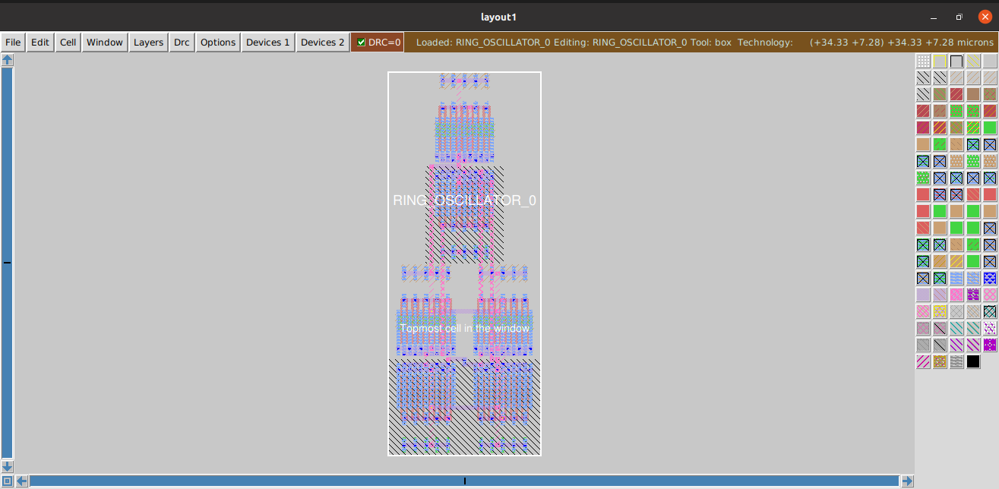
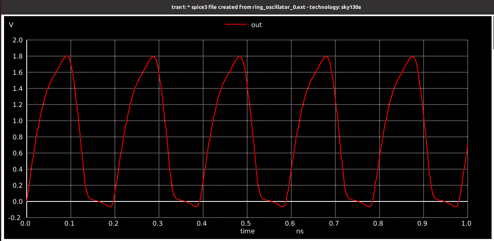

# Index
- [Ring oscillator circuit design in Xschem](https://github.com/syedimaduddin/msvsd4bituc/tree/main/Week-4#ring-oscillator-circuit-desing-in-xschem)
- [Generating layout for ring oscillator using ALIGN](https://github.com/syedimaduddin/msvsd4bituc/tree/main/Week-4#generating-layout-for-ring-oscillator-using-align)
- [Layout for the ring oscillator using Magic](https://github.com/syedimaduddin/msvsd4bituc/tree/main/Week-4#generating-layout-for-ring-oscillator-using-align)
- [Ring oscillator pre-layout and post-layout comparison](https://github.com/syedimaduddin/msvsd4bituc/blob/main/Week-4/README.md#ring-oscillator-pre-layout-and-post-layout-comparison)
- [Conclusion](https://github.com/syedimaduddin/msvsd4bituc/edit/main/Week-4/README.md#conclusion)
<!-- - [References](https://github.com/syedimaduddin/msvsd4bituc/edit/main/Week-4/README.md#references) -->

<br><br>

## Ring oscillator circuit design in Xschem

Ring oscillator generates clock-like pulses without external input except for the power it needs. A ring oscillator is a self-toggling circuit that generates clock-like pulses without external input. Inverters are cascaded back to back in odd numbers (so that the next output is different from the previous output). A 3-stage ring oscillator designed in Xschem can be seen in the following figure. 


To view the netlist extracted from xschem for ring oscillator Click Here👇
<details><summary>Netlist:</summary> 

```
** sch_path: /home/syedimaduddin/Desktop/VSD_PD_Research_Program/Week-4/xschem/ring_oscillator.sch
**.subckt ring_oscillator
XM1 net1 out GND GND sky130_fd_pr__nfet_01v8 L=0.15 W=1 nf=1 ad='int((nf+1)/2) * W/nf * 0.29' as='int((nf+2)/2) * W/nf * 0.29'
+ pd='2*int((nf+1)/2) * (W/nf + 0.29)' ps='2*int((nf+2)/2) * (W/nf + 0.29)' nrd='0.29 / W' nrs='0.29 / W'
+ sa=0 sb=0 sd=0 mult=1 m=1
XM2 net2 net1 GND GND sky130_fd_pr__nfet_01v8 L=0.15 W=1 nf=1 ad='int((nf+1)/2) * W/nf * 0.29' as='int((nf+2)/2) * W/nf * 0.29'
+ pd='2*int((nf+1)/2) * (W/nf + 0.29)' ps='2*int((nf+2)/2) * (W/nf + 0.29)' nrd='0.29 / W' nrs='0.29 / W'
+ sa=0 sb=0 sd=0 mult=1 m=1
XM3 out net2 GND GND sky130_fd_pr__nfet_01v8 L=0.15 W=1 nf=1 ad='int((nf+1)/2) * W/nf * 0.29' as='int((nf+2)/2) * W/nf * 0.29'
+ pd='2*int((nf+1)/2) * (W/nf + 0.29)' ps='2*int((nf+2)/2) * (W/nf + 0.29)' nrd='0.29 / W' nrs='0.29 / W'
+ sa=0 sb=0 sd=0 mult=1 m=1
XM4 net1 out VDD VDD sky130_fd_pr__pfet_01v8 L=0.15 W=1 nf=1 ad='int((nf+1)/2) * W/nf * 0.29' as='int((nf+2)/2) * W/nf * 0.29'
+ pd='2*int((nf+1)/2) * (W/nf + 0.29)' ps='2*int((nf+2)/2) * (W/nf + 0.29)' nrd='0.29 / W' nrs='0.29 / W'
+ sa=0 sb=0 sd=0 mult=1 m=1
XM5 net2 net1 VDD VDD sky130_fd_pr__pfet_01v8 L=0.15 W=1 nf=1 ad='int((nf+1)/2) * W/nf * 0.29' as='int((nf+2)/2) * W/nf * 0.29'
+ pd='2*int((nf+1)/2) * (W/nf + 0.29)' ps='2*int((nf+2)/2) * (W/nf + 0.29)' nrd='0.29 / W' nrs='0.29 / W'
+ sa=0 sb=0 sd=0 mult=1 m=1
XM6 out net2 VDD VDD sky130_fd_pr__pfet_01v8 L=0.15 W=1 nf=1 ad='int((nf+1)/2) * W/nf * 0.29' as='int((nf+2)/2) * W/nf * 0.29'
+ pd='2*int((nf+1)/2) * (W/nf + 0.29)' ps='2*int((nf+2)/2) * (W/nf + 0.29)' nrd='0.29 / W' nrs='0.29 / W'
+ sa=0 sb=0 sd=0 mult=1 m=1
Vdd VDD GND 1.8
.save i(vdd)
**** begin user architecture code
.lib /usr/local/share/pdk/sky130A/libs.tech/ngspice/sky130.lib.spice tt
.ic V(OUT)=0
.tran 1p 1n
.save all
**** end user architecture code
**.ends
.GLOBAL VDD
.GLOBAL GND
.end
```
</details>

Running the simulation for 1ns with a 1ps steps, we get the following output waveform. 


<br><br>

## Generating layout for ring oscillator using ALIGN

We can then move on to generating the layout for the ring oscillator using ALIGN layout tool. The first thing that we need to do is to modify the netlist that we got from Xschem into the following. The edited netlist is given below

```
.subckt ring_oscillator OUT VDD GND
XM1 net1 OUT GND GND sky130_fd_pr__nfet_01v8 L=150e-09 w=10.5e-7 nf=10 m=1
XM2 net2 net1 GND GND sky130_fd_pr__nfet_01v8 L=150e-09 w=10.5e-7 nf=10 m=1
XM3 OUT net2 GND GND sky130_fd_pr__nfet_01v8 L=150e-09 w=10.5e-7 nf=10 m=1
XM4 net1 OUT VDD VDD sky130_fd_pr__pfet_01v8 L=150e-09 w=10.5e-7 nf=10 m=1
XM5 net2 net1 VDD VDD sky130_fd_pr__pfet_01v8 L=150e-09 w=10.5e-7 nf=10 m=1
XM6 OUT net2 VDD VDD sky130_fd_pr__pfet_01v8 L=150e-09 w=10.5e-7 nf=10 m=1
.ends ring_oscillator
```

Then, we have to save this new netlist with the **.sp** extension. For this, I am saving it as ring_oscillator.sp. 

Then, we can run the ALIGN layout generator using the following command.

```
# schematic2layout.py /path_to_ring-oscillator_folder -p /path_to_pdk 
schematic2layout.py ../ALIGN-pdk-sky130/examples/ring_oscillator -p ../pdks/SKY130_PDK/
```

The run log can be seen in the image below. 


Now, we get gds file of ring oscillator layout and it will be opened in Magic by clicking on File -> Read GDS. The layout generated from Align tool is shown below.



When we extract the spice netlist, using the below commands: 

```
extract all
ext2spice cthresh 0 rthresh 0
ext2spice 
```

To view the netlist extracted from ALIGN layout Click Here👇
<details><summary>Netlist:</summary>
  
```
* SPICE3 file created from RING_OSCILLATOR_0.ext - technology: sky130A

X0 m1_828_1568# STAGE2_INV_62673116_0_0_1677810101_0/li_1179_1495# GND GND sky130_fd_pr__nfet_01v8 ad=1.47e+12p pd=1.33e+07u as=5.1975e+12p ps=4.77e+07u w=1.05e+06u l=150000u
X1 m1_828_1568# STAGE2_INV_62673116_0_0_1677810101_0/li_1179_1495# GND GND sky130_fd_pr__nfet_01v8 ad=0p pd=0u as=0p ps=0u w=1.05e+06u l=150000u
X2 GND STAGE2_INV_62673116_0_0_1677810101_0/li_1179_1495# m1_828_1568# GND sky130_fd_pr__nfet_01v8 ad=0p pd=0u as=0p ps=0u w=1.05e+06u l=150000u
X3 GND STAGE2_INV_62673116_0_0_1677810101_0/li_1179_1495# m1_828_1568# GND sky130_fd_pr__nfet_01v8 ad=0p pd=0u as=0p ps=0u w=1.05e+06u l=150000u
X4 m1_828_1568# STAGE2_INV_62673116_0_0_1677810101_0/li_1179_1495# GND GND sky130_fd_pr__nfet_01v8 ad=0p pd=0u as=0p ps=0u w=1.05e+06u l=150000u
X5 m1_828_1568# STAGE2_INV_62673116_0_0_1677810101_0/li_1179_1495# GND GND sky130_fd_pr__nfet_01v8 ad=0p pd=0u as=0p ps=0u w=1.05e+06u l=150000u
X6 GND STAGE2_INV_62673116_0_0_1677810101_0/li_1179_1495# m1_828_1568# GND sky130_fd_pr__nfet_01v8 ad=0p pd=0u as=0p ps=0u w=1.05e+06u l=150000u
X7 m1_828_1568# STAGE2_INV_62673116_0_0_1677810101_0/li_1179_1495# GND GND sky130_fd_pr__nfet_01v8 ad=0p pd=0u as=0p ps=0u w=1.05e+06u l=150000u
X8 GND STAGE2_INV_62673116_0_0_1677810101_0/li_1179_1495# m1_828_1568# GND sky130_fd_pr__nfet_01v8 ad=0p pd=0u as=0p ps=0u w=1.05e+06u l=150000u
X9 GND STAGE2_INV_62673116_0_0_1677810101_0/li_1179_1495# m1_828_1568# GND sky130_fd_pr__nfet_01v8 ad=0p pd=0u as=0p ps=0u w=1.05e+06u l=150000u
X10 STAGE2_INV_62673116_0_0_1677810101_0/li_1179_1495# OUT GND GND sky130_fd_pr__nfet_01v8 ad=1.47e+12p pd=1.33e+07u as=0p ps=0u w=1.05e+06u l=150000u
X11 STAGE2_INV_62673116_0_0_1677810101_0/li_1179_1495# OUT GND GND sky130_fd_pr__nfet_01v8 ad=0p pd=0u as=0p ps=0u w=1.05e+06u l=150000u
X12 GND OUT STAGE2_INV_62673116_0_0_1677810101_0/li_1179_1495# GND sky130_fd_pr__nfet_01v8 ad=0p pd=0u as=0p ps=0u w=1.05e+06u l=150000u
X13 GND OUT STAGE2_INV_62673116_0_0_1677810101_0/li_1179_1495# GND sky130_fd_pr__nfet_01v8 ad=0p pd=0u as=0p ps=0u w=1.05e+06u l=150000u
X14 STAGE2_INV_62673116_0_0_1677810101_0/li_1179_1495# OUT GND GND sky130_fd_pr__nfet_01v8 ad=0p pd=0u as=0p ps=0u w=1.05e+06u l=150000u
X15 STAGE2_INV_62673116_0_0_1677810101_0/li_1179_1495# OUT GND GND sky130_fd_pr__nfet_01v8 ad=0p pd=0u as=0p ps=0u w=1.05e+06u l=150000u
X16 GND OUT STAGE2_INV_62673116_0_0_1677810101_0/li_1179_1495# GND sky130_fd_pr__nfet_01v8 ad=0p pd=0u as=0p ps=0u w=1.05e+06u l=150000u
X17 STAGE2_INV_62673116_0_0_1677810101_0/li_1179_1495# OUT GND GND sky130_fd_pr__nfet_01v8 ad=0p pd=0u as=0p ps=0u w=1.05e+06u l=150000u
X18 GND OUT STAGE2_INV_62673116_0_0_1677810101_0/li_1179_1495# GND sky130_fd_pr__nfet_01v8 ad=0p pd=0u as=0p ps=0u w=1.05e+06u l=150000u
X19 GND OUT STAGE2_INV_62673116_0_0_1677810101_0/li_1179_1495# GND sky130_fd_pr__nfet_01v8 ad=0p pd=0u as=0p ps=0u w=1.05e+06u l=150000u
X20 m1_828_1568# STAGE2_INV_62673116_0_0_1677810101_0/li_1179_1495# VDD VDD sky130_fd_pr__pfet_01v8 ad=1.47e+12p pd=1.33e+07u as=5.1975e+12p ps=4.77e+07u w=1.05e+06u l=150000u
X21 VDD STAGE2_INV_62673116_0_0_1677810101_0/li_1179_1495# m1_828_1568# VDD sky130_fd_pr__pfet_01v8 ad=0p pd=0u as=0p ps=0u w=1.05e+06u l=150000u
X22 VDD STAGE2_INV_62673116_0_0_1677810101_0/li_1179_1495# m1_828_1568# VDD sky130_fd_pr__pfet_01v8 ad=0p pd=0u as=0p ps=0u w=1.05e+06u l=150000u
X23 m1_828_1568# STAGE2_INV_62673116_0_0_1677810101_0/li_1179_1495# VDD VDD sky130_fd_pr__pfet_01v8 ad=0p pd=0u as=0p ps=0u w=1.05e+06u l=150000u
X24 m1_828_1568# STAGE2_INV_62673116_0_0_1677810101_0/li_1179_1495# VDD VDD sky130_fd_pr__pfet_01v8 ad=0p pd=0u as=0p ps=0u w=1.05e+06u l=150000u
X25 VDD STAGE2_INV_62673116_0_0_1677810101_0/li_1179_1495# m1_828_1568# VDD sky130_fd_pr__pfet_01v8 ad=0p pd=0u as=0p ps=0u w=1.05e+06u l=150000u
X26 m1_828_1568# STAGE2_INV_62673116_0_0_1677810101_0/li_1179_1495# VDD VDD sky130_fd_pr__pfet_01v8 ad=0p pd=0u as=0p ps=0u w=1.05e+06u l=150000u
X27 VDD STAGE2_INV_62673116_0_0_1677810101_0/li_1179_1495# m1_828_1568# VDD sky130_fd_pr__pfet_01v8 ad=0p pd=0u as=0p ps=0u w=1.05e+06u l=150000u
X28 VDD STAGE2_INV_62673116_0_0_1677810101_0/li_1179_1495# m1_828_1568# VDD sky130_fd_pr__pfet_01v8 ad=0p pd=0u as=0p ps=0u w=1.05e+06u l=150000u
X29 m1_828_1568# STAGE2_INV_62673116_0_0_1677810101_0/li_1179_1495# VDD VDD sky130_fd_pr__pfet_01v8 ad=0p pd=0u as=0p ps=0u w=1.05e+06u l=150000u
X30 STAGE2_INV_62673116_0_0_1677810101_0/li_1179_1495# OUT VDD VDD sky130_fd_pr__pfet_01v8 ad=1.47e+12p pd=1.33e+07u as=0p ps=0u w=1.05e+06u l=150000u
X31 VDD OUT STAGE2_INV_62673116_0_0_1677810101_0/li_1179_1495# VDD sky130_fd_pr__pfet_01v8 ad=0p pd=0u as=0p ps=0u w=1.05e+06u l=150000u
X32 VDD OUT STAGE2_INV_62673116_0_0_1677810101_0/li_1179_1495# VDD sky130_fd_pr__pfet_01v8 ad=0p pd=0u as=0p ps=0u w=1.05e+06u l=150000u
X33 STAGE2_INV_62673116_0_0_1677810101_0/li_1179_1495# OUT VDD VDD sky130_fd_pr__pfet_01v8 ad=0p pd=0u as=0p ps=0u w=1.05e+06u l=150000u
X34 STAGE2_INV_62673116_0_0_1677810101_0/li_1179_1495# OUT VDD VDD sky130_fd_pr__pfet_01v8 ad=0p pd=0u as=0p ps=0u w=1.05e+06u l=150000u
X35 VDD OUT STAGE2_INV_62673116_0_0_1677810101_0/li_1179_1495# VDD sky130_fd_pr__pfet_01v8 ad=0p pd=0u as=0p ps=0u w=1.05e+06u l=150000u
X36 STAGE2_INV_62673116_0_0_1677810101_0/li_1179_1495# OUT VDD VDD sky130_fd_pr__pfet_01v8 ad=0p pd=0u as=0p ps=0u w=1.05e+06u l=150000u
X37 VDD OUT STAGE2_INV_62673116_0_0_1677810101_0/li_1179_1495# VDD sky130_fd_pr__pfet_01v8 ad=0p pd=0u as=0p ps=0u w=1.05e+06u l=150000u
X38 VDD OUT STAGE2_INV_62673116_0_0_1677810101_0/li_1179_1495# VDD sky130_fd_pr__pfet_01v8 ad=0p pd=0u as=0p ps=0u w=1.05e+06u l=150000u
X39 STAGE2_INV_62673116_0_0_1677810101_0/li_1179_1495# OUT VDD VDD sky130_fd_pr__pfet_01v8 ad=0p pd=0u as=0p ps=0u w=1.05e+06u l=150000u
X40 OUT m1_828_1568# VDD VDD sky130_fd_pr__pfet_01v8 ad=1.47e+12p pd=1.33e+07u as=0p ps=0u w=1.05e+06u l=150000u
X41 VDD m1_828_1568# OUT VDD sky130_fd_pr__pfet_01v8 ad=0p pd=0u as=0p ps=0u w=1.05e+06u l=150000u
X42 VDD m1_828_1568# OUT VDD sky130_fd_pr__pfet_01v8 ad=0p pd=0u as=0p ps=0u w=1.05e+06u l=150000u
X43 OUT m1_828_1568# VDD VDD sky130_fd_pr__pfet_01v8 ad=0p pd=0u as=0p ps=0u w=1.05e+06u l=150000u
X44 OUT m1_828_1568# VDD VDD sky130_fd_pr__pfet_01v8 ad=0p pd=0u as=0p ps=0u w=1.05e+06u l=150000u
X45 VDD m1_828_1568# OUT VDD sky130_fd_pr__pfet_01v8 ad=0p pd=0u as=0p ps=0u w=1.05e+06u l=150000u
X46 OUT m1_828_1568# VDD VDD sky130_fd_pr__pfet_01v8 ad=0p pd=0u as=0p ps=0u w=1.05e+06u l=150000u
X47 VDD m1_828_1568# OUT VDD sky130_fd_pr__pfet_01v8 ad=0p pd=0u as=0p ps=0u w=1.05e+06u l=150000u
X48 VDD m1_828_1568# OUT VDD sky130_fd_pr__pfet_01v8 ad=0p pd=0u as=0p ps=0u w=1.05e+06u l=150000u
X49 OUT m1_828_1568# VDD VDD sky130_fd_pr__pfet_01v8 ad=0p pd=0u as=0p ps=0u w=1.05e+06u l=150000u
X50 OUT m1_828_1568# GND GND sky130_fd_pr__nfet_01v8 ad=1.47e+12p pd=1.33e+07u as=0p ps=0u w=1.05e+06u l=150000u
X51 OUT m1_828_1568# GND GND sky130_fd_pr__nfet_01v8 ad=0p pd=0u as=0p ps=0u w=1.05e+06u l=150000u
X52 GND m1_828_1568# OUT GND sky130_fd_pr__nfet_01v8 ad=0p pd=0u as=0p ps=0u w=1.05e+06u l=150000u
X53 GND m1_828_1568# OUT GND sky130_fd_pr__nfet_01v8 ad=0p pd=0u as=0p ps=0u w=1.05e+06u l=150000u
X54 OUT m1_828_1568# GND GND sky130_fd_pr__nfet_01v8 ad=0p pd=0u as=0p ps=0u w=1.05e+06u l=150000u
X55 OUT m1_828_1568# GND GND sky130_fd_pr__nfet_01v8 ad=0p pd=0u as=0p ps=0u w=1.05e+06u l=150000u
X56 GND m1_828_1568# OUT GND sky130_fd_pr__nfet_01v8 ad=0p pd=0u as=0p ps=0u w=1.05e+06u l=150000u
X57 OUT m1_828_1568# GND GND sky130_fd_pr__nfet_01v8 ad=0p pd=0u as=0p ps=0u w=1.05e+06u l=150000u
X58 GND m1_828_1568# OUT GND sky130_fd_pr__nfet_01v8 ad=0p pd=0u as=0p ps=0u w=1.05e+06u l=150000u
X59 GND m1_828_1568# OUT GND sky130_fd_pr__nfet_01v8 ad=0p pd=0u as=0p ps=0u w=1.05e+06u l=150000u
C0 VDD OUT 8.55fF
C1 VDD STAGE2_INV_62673116_0_0_1677810101_0/li_1179_1495# 8.51fF
C2 m1_828_1568# OUT 1.84fF
C3 m1_828_1568# STAGE2_INV_62673116_0_0_1677810101_0/li_1179_1495# 1.83fF
C4 STAGE2_INV_62673116_0_0_1677810101_0/li_1179_1495# OUT 1.49fF
C5 m1_828_1568# VDD 7.87fF
C6 OUT GND 6.41fF 
C7 m1_828_1568# GND 6.52fF 
C8 STAGE2_INV_62673116_0_0_1677810101_0/li_1179_1495# GND 5.34fF 
C9 VDD GND 17.11fF 
```
</details>

Then, adding the design to a testbench as shown in this  
<details><summary>Netilist:</summary>
  
```
* SPICE3 file created from RING_OSCILLATOR_0.ext - technology: sky130A
V1 VDD GND 1.8
x1 OUT GND VDD ring_oscillator
**** begin user architecture code
.ic V(OUT)=0
.tran 1p 1n
.lib /usr/local/share/pdk/sky130A/libs.tech/ngspice/sky130.lib.spice tt
**** end user architecture code
.subckt ring_oscillator OUT GND VDD
X0 m1_828_1568# STAGE2_INV_62673116_0_0_1677810101_0/li_1179_1495# GND GND sky130_fd_pr__nfet_01v8 ad=1.47e+12p pd=1.33e+07u as=5.1975e+12p ps=4.77e+07u w=1.05e+06u l=150000u
X1 m1_828_1568# STAGE2_INV_62673116_0_0_1677810101_0/li_1179_1495# GND GND sky130_fd_pr__nfet_01v8 ad=0p pd=0u as=0p ps=0u w=1.05e+06u l=150000u
X2 GND STAGE2_INV_62673116_0_0_1677810101_0/li_1179_1495# m1_828_1568# GND sky130_fd_pr__nfet_01v8 ad=0p pd=0u as=0p ps=0u w=1.05e+06u l=150000u
X3 GND STAGE2_INV_62673116_0_0_1677810101_0/li_1179_1495# m1_828_1568# GND sky130_fd_pr__nfet_01v8 ad=0p pd=0u as=0p ps=0u w=1.05e+06u l=150000u
X4 m1_828_1568# STAGE2_INV_62673116_0_0_1677810101_0/li_1179_1495# GND GND sky130_fd_pr__nfet_01v8 ad=0p pd=0u as=0p ps=0u w=1.05e+06u l=150000u
X5 m1_828_1568# STAGE2_INV_62673116_0_0_1677810101_0/li_1179_1495# GND GND sky130_fd_pr__nfet_01v8 ad=0p pd=0u as=0p ps=0u w=1.05e+06u l=150000u
X6 GND STAGE2_INV_62673116_0_0_1677810101_0/li_1179_1495# m1_828_1568# GND sky130_fd_pr__nfet_01v8 ad=0p pd=0u as=0p ps=0u w=1.05e+06u l=150000u
X7 m1_828_1568# STAGE2_INV_62673116_0_0_1677810101_0/li_1179_1495# GND GND sky130_fd_pr__nfet_01v8 ad=0p pd=0u as=0p ps=0u w=1.05e+06u l=150000u
X8 GND STAGE2_INV_62673116_0_0_1677810101_0/li_1179_1495# m1_828_1568# GND sky130_fd_pr__nfet_01v8 ad=0p pd=0u as=0p ps=0u w=1.05e+06u l=150000u
X9 GND STAGE2_INV_62673116_0_0_1677810101_0/li_1179_1495# m1_828_1568# GND sky130_fd_pr__nfet_01v8 ad=0p pd=0u as=0p ps=0u w=1.05e+06u l=150000u
X10 STAGE2_INV_62673116_0_0_1677810101_0/li_1179_1495# OUT GND GND sky130_fd_pr__nfet_01v8 ad=1.47e+12p pd=1.33e+07u as=0p ps=0u w=1.05e+06u l=150000u
X11 STAGE2_INV_62673116_0_0_1677810101_0/li_1179_1495# OUT GND GND sky130_fd_pr__nfet_01v8 ad=0p pd=0u as=0p ps=0u w=1.05e+06u l=150000u
X12 GND OUT STAGE2_INV_62673116_0_0_1677810101_0/li_1179_1495# GND sky130_fd_pr__nfet_01v8 ad=0p pd=0u as=0p ps=0u w=1.05e+06u l=150000u
X13 GND OUT STAGE2_INV_62673116_0_0_1677810101_0/li_1179_1495# GND sky130_fd_pr__nfet_01v8 ad=0p pd=0u as=0p ps=0u w=1.05e+06u l=150000u
X14 STAGE2_INV_62673116_0_0_1677810101_0/li_1179_1495# OUT GND GND sky130_fd_pr__nfet_01v8 ad=0p pd=0u as=0p ps=0u w=1.05e+06u l=150000u
X15 STAGE2_INV_62673116_0_0_1677810101_0/li_1179_1495# OUT GND GND sky130_fd_pr__nfet_01v8 ad=0p pd=0u as=0p ps=0u w=1.05e+06u l=150000u
X16 GND OUT STAGE2_INV_62673116_0_0_1677810101_0/li_1179_1495# GND sky130_fd_pr__nfet_01v8 ad=0p pd=0u as=0p ps=0u w=1.05e+06u l=150000u
X17 STAGE2_INV_62673116_0_0_1677810101_0/li_1179_1495# OUT GND GND sky130_fd_pr__nfet_01v8 ad=0p pd=0u as=0p ps=0u w=1.05e+06u l=150000u
X18 GND OUT STAGE2_INV_62673116_0_0_1677810101_0/li_1179_1495# GND sky130_fd_pr__nfet_01v8 ad=0p pd=0u as=0p ps=0u w=1.05e+06u l=150000u
X19 GND OUT STAGE2_INV_62673116_0_0_1677810101_0/li_1179_1495# GND sky130_fd_pr__nfet_01v8 ad=0p pd=0u as=0p ps=0u w=1.05e+06u l=150000u
X20 m1_828_1568# STAGE2_INV_62673116_0_0_1677810101_0/li_1179_1495# VDD VDD sky130_fd_pr__pfet_01v8 ad=1.47e+12p pd=1.33e+07u as=5.1975e+12p ps=4.77e+07u w=1.05e+06u l=150000u
X21 VDD STAGE2_INV_62673116_0_0_1677810101_0/li_1179_1495# m1_828_1568# VDD sky130_fd_pr__pfet_01v8 ad=0p pd=0u as=0p ps=0u w=1.05e+06u l=150000u
X22 VDD STAGE2_INV_62673116_0_0_1677810101_0/li_1179_1495# m1_828_1568# VDD sky130_fd_pr__pfet_01v8 ad=0p pd=0u as=0p ps=0u w=1.05e+06u l=150000u
X23 m1_828_1568# STAGE2_INV_62673116_0_0_1677810101_0/li_1179_1495# VDD VDD sky130_fd_pr__pfet_01v8 ad=0p pd=0u as=0p ps=0u w=1.05e+06u l=150000u
X24 m1_828_1568# STAGE2_INV_62673116_0_0_1677810101_0/li_1179_1495# VDD VDD sky130_fd_pr__pfet_01v8 ad=0p pd=0u as=0p ps=0u w=1.05e+06u l=150000u
X25 VDD STAGE2_INV_62673116_0_0_1677810101_0/li_1179_1495# m1_828_1568# VDD sky130_fd_pr__pfet_01v8 ad=0p pd=0u as=0p ps=0u w=1.05e+06u l=150000u
X26 m1_828_1568# STAGE2_INV_62673116_0_0_1677810101_0/li_1179_1495# VDD VDD sky130_fd_pr__pfet_01v8 ad=0p pd=0u as=0p ps=0u w=1.05e+06u l=150000u
X27 VDD STAGE2_INV_62673116_0_0_1677810101_0/li_1179_1495# m1_828_1568# VDD sky130_fd_pr__pfet_01v8 ad=0p pd=0u as=0p ps=0u w=1.05e+06u l=150000u
X28 VDD STAGE2_INV_62673116_0_0_1677810101_0/li_1179_1495# m1_828_1568# VDD sky130_fd_pr__pfet_01v8 ad=0p pd=0u as=0p ps=0u w=1.05e+06u l=150000u
X29 m1_828_1568# STAGE2_INV_62673116_0_0_1677810101_0/li_1179_1495# VDD VDD sky130_fd_pr__pfet_01v8 ad=0p pd=0u as=0p ps=0u w=1.05e+06u l=150000u
X30 STAGE2_INV_62673116_0_0_1677810101_0/li_1179_1495# OUT VDD VDD sky130_fd_pr__pfet_01v8 ad=1.47e+12p pd=1.33e+07u as=0p ps=0u w=1.05e+06u l=150000u
X31 VDD OUT STAGE2_INV_62673116_0_0_1677810101_0/li_1179_1495# VDD sky130_fd_pr__pfet_01v8 ad=0p pd=0u as=0p ps=0u w=1.05e+06u l=150000u
X32 VDD OUT STAGE2_INV_62673116_0_0_1677810101_0/li_1179_1495# VDD sky130_fd_pr__pfet_01v8 ad=0p pd=0u as=0p ps=0u w=1.05e+06u l=150000u
X33 STAGE2_INV_62673116_0_0_1677810101_0/li_1179_1495# OUT VDD VDD sky130_fd_pr__pfet_01v8 ad=0p pd=0u as=0p ps=0u w=1.05e+06u l=150000u
X34 STAGE2_INV_62673116_0_0_1677810101_0/li_1179_1495# OUT VDD VDD sky130_fd_pr__pfet_01v8 ad=0p pd=0u as=0p ps=0u w=1.05e+06u l=150000u
X35 VDD OUT STAGE2_INV_62673116_0_0_1677810101_0/li_1179_1495# VDD sky130_fd_pr__pfet_01v8 ad=0p pd=0u as=0p ps=0u w=1.05e+06u l=150000u
X36 STAGE2_INV_62673116_0_0_1677810101_0/li_1179_1495# OUT VDD VDD sky130_fd_pr__pfet_01v8 ad=0p pd=0u as=0p ps=0u w=1.05e+06u l=150000u
X37 VDD OUT STAGE2_INV_62673116_0_0_1677810101_0/li_1179_1495# VDD sky130_fd_pr__pfet_01v8 ad=0p pd=0u as=0p ps=0u w=1.05e+06u l=150000u
X38 VDD OUT STAGE2_INV_62673116_0_0_1677810101_0/li_1179_1495# VDD sky130_fd_pr__pfet_01v8 ad=0p pd=0u as=0p ps=0u w=1.05e+06u l=150000u
X39 STAGE2_INV_62673116_0_0_1677810101_0/li_1179_1495# OUT VDD VDD sky130_fd_pr__pfet_01v8 ad=0p pd=0u as=0p ps=0u w=1.05e+06u l=150000u
X40 OUT m1_828_1568# VDD VDD sky130_fd_pr__pfet_01v8 ad=1.47e+12p pd=1.33e+07u as=0p ps=0u w=1.05e+06u l=150000u
X41 VDD m1_828_1568# OUT VDD sky130_fd_pr__pfet_01v8 ad=0p pd=0u as=0p ps=0u w=1.05e+06u l=150000u
X42 VDD m1_828_1568# OUT VDD sky130_fd_pr__pfet_01v8 ad=0p pd=0u as=0p ps=0u w=1.05e+06u l=150000u
X43 OUT m1_828_1568# VDD VDD sky130_fd_pr__pfet_01v8 ad=0p pd=0u as=0p ps=0u w=1.05e+06u l=150000u
X44 OUT m1_828_1568# VDD VDD sky130_fd_pr__pfet_01v8 ad=0p pd=0u as=0p ps=0u w=1.05e+06u l=150000u
X45 VDD m1_828_1568# OUT VDD sky130_fd_pr__pfet_01v8 ad=0p pd=0u as=0p ps=0u w=1.05e+06u l=150000u
X46 OUT m1_828_1568# VDD VDD sky130_fd_pr__pfet_01v8 ad=0p pd=0u as=0p ps=0u w=1.05e+06u l=150000u
X47 VDD m1_828_1568# OUT VDD sky130_fd_pr__pfet_01v8 ad=0p pd=0u as=0p ps=0u w=1.05e+06u l=150000u
X48 VDD m1_828_1568# OUT VDD sky130_fd_pr__pfet_01v8 ad=0p pd=0u as=0p ps=0u w=1.05e+06u l=150000u
X49 OUT m1_828_1568# VDD VDD sky130_fd_pr__pfet_01v8 ad=0p pd=0u as=0p ps=0u w=1.05e+06u l=150000u
X50 OUT m1_828_1568# GND GND sky130_fd_pr__nfet_01v8 ad=1.47e+12p pd=1.33e+07u as=0p ps=0u w=1.05e+06u l=150000u
X51 OUT m1_828_1568# GND GND sky130_fd_pr__nfet_01v8 ad=0p pd=0u as=0p ps=0u w=1.05e+06u l=150000u
X52 GND m1_828_1568# OUT GND sky130_fd_pr__nfet_01v8 ad=0p pd=0u as=0p ps=0u w=1.05e+06u l=150000u
X53 GND m1_828_1568# OUT GND sky130_fd_pr__nfet_01v8 ad=0p pd=0u as=0p ps=0u w=1.05e+06u l=150000u
X54 OUT m1_828_1568# GND GND sky130_fd_pr__nfet_01v8 ad=0p pd=0u as=0p ps=0u w=1.05e+06u l=150000u
X55 OUT m1_828_1568# GND GND sky130_fd_pr__nfet_01v8 ad=0p pd=0u as=0p ps=0u w=1.05e+06u l=150000u
X56 GND m1_828_1568# OUT GND sky130_fd_pr__nfet_01v8 ad=0p pd=0u as=0p ps=0u w=1.05e+06u l=150000u
X57 OUT m1_828_1568# GND GND sky130_fd_pr__nfet_01v8 ad=0p pd=0u as=0p ps=0u w=1.05e+06u l=150000u
X58 GND m1_828_1568# OUT GND sky130_fd_pr__nfet_01v8 ad=0p pd=0u as=0p ps=0u w=1.05e+06u l=150000u
X59 GND m1_828_1568# OUT GND sky130_fd_pr__nfet_01v8 ad=0p pd=0u as=0p ps=0u w=1.05e+06u l=150000u
C0 VDD OUT 8.55fF
C1 VDD STAGE2_INV_62673116_0_0_1677810101_0/li_1179_1495# 8.51fF
C2 m1_828_1568# OUT 1.84fF
C3 m1_828_1568# STAGE2_INV_62673116_0_0_1677810101_0/li_1179_1495# 1.83fF
C4 STAGE2_INV_62673116_0_0_1677810101_0/li_1179_1495# OUT 1.49fF
C5 m1_828_1568# VDD 7.87fF
C6 OUT GND 6.41fF 
C7 m1_828_1568# GND 6.52fF 
C8 STAGE2_INV_62673116_0_0_1677810101_0/li_1179_1495# GND 5.34fF 
C9 VDD GND 17.11fF 
.ends
```
</details

Output waveform from above post layout simulation using ALIGN


<br><br>

## Layout for the ring oscillator using Magic

We can then go ahead and create a layout manually using Magic. To do that, we first import the netlist generated by Xschem and then arrange and route the cells as shown below.


We then extract the netlist using the same commands as mentioned in case of align layout, and get this
<details><summary>Netlist:</summary>
  
```
* SPICE3 file created from ring_oscillator.ext - technology: sky130A
.subckt ring_oscillator OUT GND VDD
X0 m1_422_986# OUT GND VSUBS sky130_fd_pr__nfet_01v8 ad=2.9e+11p pd=2.58e+06u as=8.7e+11p ps=7.74e+06u w=1e+06u l=150000u
X1 m1_474_n58# m1_422_986# GND VSUBS sky130_fd_pr__nfet_01v8 ad=2.9e+11p pd=2.58e+06u as=0p ps=0u w=1e+06u l=150000u
X2 OUT m1_474_n58# GND VSUBS sky130_fd_pr__nfet_01v8 ad=2.9e+11p pd=2.58e+06u as=0p ps=0u w=1e+06u l=150000u
X3 m1_422_986# OUT VDD XM4/w_n211_n319# sky130_fd_pr__pfet_01v8 ad=2.9e+11p pd=2.58e+06u as=8.7e+11p ps=7.74e+06u w=1e+06u l=150000u
X4 m1_474_n58# m1_422_986# VDD XM5/w_n211_n319# sky130_fd_pr__pfet_01v8 ad=2.9e+11p pd=2.58e+06u as=0p ps=0u w=1e+06u l=150000u
X5 OUT m1_474_n58# VDD XM6/w_n211_n319# sky130_fd_pr__pfet_01v8 ad=2.9e+11p pd=2.58e+06u as=0p ps=0u w=1e+06u l=150000u
C0 m1_422_986# XM6/w_n211_n319# 0.00fF
C1 XM5/w_n211_n319# XM6/w_n211_n319# 0.03fF
C2 XM4/w_n211_n319# XM6/w_n211_n319# 0.00fF
C3 m1_422_986# m1_474_n58# 0.18fF
C4 XM5/w_n211_n319# m1_474_n58# 0.17fF
C5 XM4/w_n211_n319# m1_474_n58# 0.00fF
C6 GND OUT 0.35fF
C7 VDD OUT 0.33fF
C8 m1_422_986# XM5/w_n211_n319# 0.43fF
C9 m1_422_986# XM4/w_n211_n319# 0.17fF
C10 GND XM6/w_n211_n319# 0.00fF
C11 VDD XM6/w_n211_n319# 0.36fF
C12 XM4/w_n211_n319# XM5/w_n211_n319# 0.03fF
C13 GND m1_474_n58# 0.37fF
C14 VDD m1_474_n58# 0.37fF
C15 m1_422_986# GND 0.36fF
C16 m1_422_986# VDD 0.36fF
C17 GND XM5/w_n211_n319# 0.00fF
C18 VDD XM5/w_n211_n319# 0.37fF
C19 GND XM4/w_n211_n319# 0.00fF
C20 VDD XM4/w_n211_n319# 0.40fF
C21 OUT XM6/w_n211_n319# 0.17fF
C22 OUT m1_474_n58# 0.52fF
C23 GND VDD 0.01fF
C24 m1_422_986# OUT 0.52fF
C25 m1_474_n58# XM6/w_n211_n319# 0.39fF
C26 XM5/w_n211_n319# OUT 0.03fF
C27 XM4/w_n211_n319# OUT 0.36fF
C28 m1_474_n58# VSUBS 0.46fF **FLOATING
C29 m1_422_986# VSUBS 0.39fF **FLOATING
C30 XM6/w_n211_n319# VSUBS 1.10fF **FLOATING
C31 XM5/w_n211_n319# VSUBS 1.10fF **FLOATING
C32 XM4/w_n211_n319# VSUBS 1.10fF **FLOATING
C33 OUT VSUBS 1.47fF
C34 GND VSUBS 0.87fF
.ends
```
</details>

Then, repeating the same steps that we followed in simulating ALIGN generated netlist, we create this testbench
<details><summary>Netlist:</summary>
  
```
* SPICE3 file created from ring_oscillator.ext - technology: sky130A
V1 VDD GND 1.8
x1 OUT GND VDD ring_oscillator
**** begin user architecture code
.ic V(OUT)=0
.tran 1p 1n
.lib /usr/local/share/pdk/sky130A/libs.tech/ngspice/sky130.lib.spice tt
**** end user architecture code
  
.subckt ring_oscillator OUT GND VDD
X0 m1_422_986# OUT GND VSUBS sky130_fd_pr__nfet_01v8 ad=2.9e+11p pd=2.58e+06u as=8.7e+11p ps=7.74e+06u w=1e+06u l=150000u
X1 m1_474_n58# m1_422_986# GND VSUBS sky130_fd_pr__nfet_01v8 ad=2.9e+11p pd=2.58e+06u as=0p ps=0u w=1e+06u l=150000u
X2 OUT m1_474_n58# GND VSUBS sky130_fd_pr__nfet_01v8 ad=2.9e+11p pd=2.58e+06u as=0p ps=0u w=1e+06u l=150000u
X3 m1_422_986# OUT VDD XM4/w_n211_n319# sky130_fd_pr__pfet_01v8 ad=2.9e+11p pd=2.58e+06u as=8.7e+11p ps=7.74e+06u w=1e+06u l=150000u
X4 m1_474_n58# m1_422_986# VDD XM5/w_n211_n319# sky130_fd_pr__pfet_01v8 ad=2.9e+11p pd=2.58e+06u as=0p ps=0u w=1e+06u l=150000u
X5 OUT m1_474_n58# VDD XM6/w_n211_n319# sky130_fd_pr__pfet_01v8 ad=2.9e+11p pd=2.58e+06u as=0p ps=0u w=1e+06u l=150000u
C0 m1_422_986# XM6/w_n211_n319# 0.00fF
C1 XM5/w_n211_n319# XM6/w_n211_n319# 0.03fF
C2 XM4/w_n211_n319# XM6/w_n211_n319# 0.00fF
C3 m1_422_986# m1_474_n58# 0.18fF
C4 XM5/w_n211_n319# m1_474_n58# 0.17fF
C5 XM4/w_n211_n319# m1_474_n58# 0.00fF
C6 GND OUT 0.35fF
C7 VDD OUT 0.33fF
C8 m1_422_986# XM5/w_n211_n319# 0.43fF
C9 m1_422_986# XM4/w_n211_n319# 0.17fF
C10 GND XM6/w_n211_n319# 0.00fF
C11 VDD XM6/w_n211_n319# 0.36fF
C12 XM4/w_n211_n319# XM5/w_n211_n319# 0.03fF
C13 GND m1_474_n58# 0.37fF
C14 VDD m1_474_n58# 0.37fF
C15 m1_422_986# GND 0.36fF
C16 m1_422_986# VDD 0.36fF
C17 GND XM5/w_n211_n319# 0.00fF
C18 VDD XM5/w_n211_n319# 0.37fF
C19 GND XM4/w_n211_n319# 0.00fF
C20 VDD XM4/w_n211_n319# 0.40fF
C21 OUT XM6/w_n211_n319# 0.17fF
C22 OUT m1_474_n58# 0.52fF
C23 GND VDD 0.01fF
C24 m1_422_986# OUT 0.52fF
C25 m1_474_n58# XM6/w_n211_n319# 0.39fF
C26 XM5/w_n211_n319# OUT 0.03fF
C27 XM4/w_n211_n319# OUT 0.36fF
C28 m1_474_n58# VSUBS 0.46fF 
C29 m1_422_986# VSUBS 0.39fF 
C30 XM6/w_n211_n319# VSUBS 1.10fF 
C31 XM5/w_n211_n319# VSUBS 1.10fF
C32 XM4/w_n211_n319# VSUBS 1.10fF 
C33 OUT VSUBS 1.47fF
C34 GND VSUBS 0.87fF
.ends  
```
</details>

We get the following waveform as the result of the simulation of ring oscillator after custom layout using Magic


And, this output validates the working of the ring oscillator layout created in Magic.

<!--## Analaysis of the ring oscillator pre-layout and post-layout results-->

## Ring oscillator pre-layout and post-layout comparison
According to the waveforms of the pre-layout simulation (using Xschem) and post-layout simulation (using ALIGN & Magic) of the ring oscillator, the post-layout simulation time-period is longer (due to capacitances). Afterwards, post-layout simulation results in a reduction in voltage magnitude. We can also compare between post-layout simulation using ALIGN and Magic, as in ALIGN we got less time period than Magic also the magnitude of voltage is more in ALIGN.
  
## Conclusion
Using the XSchem tool, I designed a schematic for a Ring Oscillator (3-stage) and obtained the desired output using Ngspice. Next we used ALIGN to convert netlist into layout in GDS format, then we used Magic to convert GDS into netlist again (with parasitics) to see the waveform of its output using Ngspice. It has been noticed that the output of the ALIGN tool is the same, but the time period of the oscillator has been increased, which reduces the maximum operating speed. Following the design of a custom layout for the Ring Oscillator, the output of the Magic is observed using Ngspice, which is similar to ALIGN but it has a longer time period. Therefore, we can say that ALIGN does a good job owing to the fact that it requires less effort and delivers satisfactory results.

<!-- ## References -->

