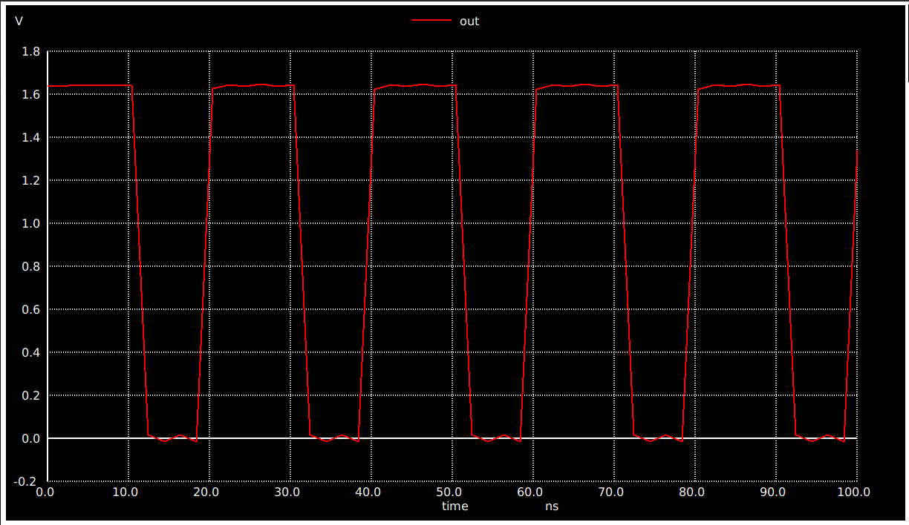

## Index
- [1 bit ADC](#1-bit-adc)
    * [Comparator Pre-Layout using Xschem](#comparator-pre-layout-using-xschem)
        + [150nm Comparator Design](#150nm-comparator-design)
        + [Ring_Oscillator](#ring_oscillator)
        + [Simulation ADC with Ring Oscillator](#simulation-adc-with-ring-oscillator)
        + [Output](#output)
    * [ALIGN Flow](#comparator-pre-layout-using-xschem)
        + [RING_OSCILLATOR ALIGN SPICE Netlist](#ring_oscillator-align-spice-netlist)
        + [ADC ALIGN SPICE Netlist](#adc-align-spice-netlist)
        + [Simulation ADC with Ring Oscillator](#simulation-adc-with-ring-oscillator)
        + [Magic View ADC ](#magic-view-adc)
        + [Magic Generated Netlist](#magic-generated-netlist)
            + [Pre-Layout Simulation with Sine Wave](#pre-layout-simulation-with-sine-wave)
            + [Post-Layout Simulation with Sine Wave](#post-layout-simulation-with-sine-wave)
        + [Lef & GDS File For OpenFASoC Flow](#lef--gds-file-for-openfasoc-flow)
- [OpenFASoC Flow Verilog File](#openfasoc-flow-verilog-file)
<!-- - [Creating inverter schematic using xschem](#creating-inverter-schematic-using-xschem)
    * [Pre-Layout Simulation](#pre-layout-simulation)
        + [Creating and simulating testbench Schematic](#creating-and-simulating-testbench-schematic)
    * [Post-Layout Simulation](#post-layout-simulation)
    * [Comparison of Pre-layout and Post-layout timing parameters for inverter](#comparison-of-pre-layout-and-post-layout-timing-parameters-for-inverter)
    * [LVS Report](#lvs-report)
     -->


## 1-bit ADC (Analog to Digital Converter)

### ADC Schematic using Xschem


View the Netlist generated by xschem, Click Here👇
<details><summary>Netlist</summary>

```
** sch_path: /home/syedimaduddin/Desktop/VSD_PD_Research_Program/Week-5/xschem/adc_1bit.sch
**.subckt adc_1bit
XM1 net4 net2 VDD VDD sky130_fd_pr__pfet_01v8 L=0.15 W=1 nf=1 ad='int((nf+1)/2) * W/nf * 0.29' as='int((nf+2)/2) * W/nf * 0.29'
+ pd='2*int((nf+1)/2) * (W/nf + 0.29)' ps='2*int((nf+2)/2) * (W/nf + 0.29)' nrd='0.29 / W' nrs='0.29 / W'
+ sa=0 sb=0 sd=0 mult=1 m=1
XM2 out net4 VDD VDD sky130_fd_pr__pfet_01v8 L=0.15 W=1 nf=1 ad='int((nf+1)/2) * W/nf * 0.29' as='int((nf+2)/2) * W/nf * 0.29'
+ pd='2*int((nf+1)/2) * (W/nf + 0.29)' ps='2*int((nf+2)/2) * (W/nf + 0.29)' nrd='0.29 / W' nrs='0.29 / W'
+ sa=0 sb=0 sd=0 mult=1 m=1
XM3 net2 net2 VDD VDD sky130_fd_pr__pfet_01v8 L=0.15 W=1 nf=1 ad='int((nf+1)/2) * W/nf * 0.29' as='int((nf+2)/2) * W/nf * 0.29'
+ pd='2*int((nf+1)/2) * (W/nf + 0.29)' ps='2*int((nf+2)/2) * (W/nf + 0.29)' nrd='0.29 / W' nrs='0.29 / W'
+ sa=0 sb=0 sd=0 mult=1 m=1
XM4 net1 net1 VDD VDD sky130_fd_pr__pfet_01v8 L=0.15 W=1 nf=1 ad='int((nf+1)/2) * W/nf * 0.29' as='int((nf+2)/2) * W/nf * 0.29'
+ pd='2*int((nf+1)/2) * (W/nf + 0.29)' ps='2*int((nf+2)/2) * (W/nf + 0.29)' nrd='0.29 / W' nrs='0.29 / W'
+ sa=0 sb=0 sd=0 mult=1 m=1
XM5 net2 in1 net3 net3 sky130_fd_pr__nfet_01v8 L=0.15 W=1 nf=1 ad='int((nf+1)/2) * W/nf * 0.29' as='int((nf+2)/2) * W/nf * 0.29'
+ pd='2*int((nf+1)/2) * (W/nf + 0.29)' ps='2*int((nf+2)/2) * (W/nf + 0.29)' nrd='0.29 / W' nrs='0.29 / W'
+ sa=0 sb=0 sd=0 mult=1 m=1
XM6 net4 in2 net3 net3 sky130_fd_pr__nfet_01v8 L=0.15 W=1 nf=1 ad='int((nf+1)/2) * W/nf * 0.29' as='int((nf+2)/2) * W/nf * 0.29'
+ pd='2*int((nf+1)/2) * (W/nf + 0.29)' ps='2*int((nf+2)/2) * (W/nf + 0.29)' nrd='0.29 / W' nrs='0.29 / W'
+ sa=0 sb=0 sd=0 mult=1 m=1
XM7 net1 net1 GND GND sky130_fd_pr__nfet_01v8 L=0.15 W=1 nf=1 ad='int((nf+1)/2) * W/nf * 0.29' as='int((nf+2)/2) * W/nf * 0.29'
+ pd='2*int((nf+1)/2) * (W/nf + 0.29)' ps='2*int((nf+2)/2) * (W/nf + 0.29)' nrd='0.29 / W' nrs='0.29 / W'
+ sa=0 sb=0 sd=0 mult=1 m=1
XM8 net3 net1 GND GND sky130_fd_pr__nfet_01v8 L=0.15 W=1 nf=1 ad='int((nf+1)/2) * W/nf * 0.29' as='int((nf+2)/2) * W/nf * 0.29'
+ pd='2*int((nf+1)/2) * (W/nf + 0.29)' ps='2*int((nf+2)/2) * (W/nf + 0.29)' nrd='0.29 / W' nrs='0.29 / W'
+ sa=0 sb=0 sd=0 mult=1 m=1
XM9 out net1 GND GND sky130_fd_pr__nfet_01v8 L=0.15 W=1 nf=1 ad='int((nf+1)/2) * W/nf * 0.29' as='int((nf+2)/2) * W/nf * 0.29'
+ pd='2*int((nf+1)/2) * (W/nf + 0.29)' ps='2*int((nf+2)/2) * (W/nf + 0.29)' nrd='0.29 / W' nrs='0.29 / W'
+ sa=0 sb=0 sd=0 mult=1 m=1
Vdd VDD GND 1.8
.save i(vdd)
V1 in1 GND 1.2
.save i(v1)
V2 in2 GND sin(1.5 1.5 50meg 0.5n)
.save i(v2)
**** begin user architecture code
.lib /usr/local/share/pdk/sky130A/libs.tech/ngspice/sky130.lib.spice tt
.tran 4n 100n
.save all
**** end user architecture code
**.ends
.GLOBAL VDD
.GLOBAL GND
.end
```
</details>

#### Pre-Layout Simulation of 1-bit ADC



### ADC Layout using ALIGN Tool
Netlist used for conversion from schematic to layout using ALIGN
```
.subckt ring_oscillator VCC GND INP
M1 net1 INP VCC VCC sky130_fd_pr__pfet_01v8 L=1200-9 W=25.2e-7
M2 net2 net1 VCC VCC sky130_fd_pr__pfet_01v8 L=1200-9 W=25.2e-7
M3 INP net2 VCC VCC sky130_fd_pr__pfet_01v8 L=1200-9 W=25.2e-7
M4 net1 INP GND GND sky130_fd_pr__nfet_01v8 L=1200-9 W=25.2e-7
M5 net2 net1 GND GND sky130_fd_pr__nfet_01v8 L=1200-9 W=25.2e-7
M6 INP net2 GND GND sky130_fd_pr__nfet_01v8 L=1200-9 W=25.2e-7
.ends
```

#### Magic View ADC Layout generated from ALIGN


Extract the netlist of above ADC Layout from magic using the following commands

```
extract all
ext2spice cthresh 0 rthresh 0
ext2spice
```
View extracted Netlist from magic, Click Here👇
<details><summary>Netlist</summary>

```

```
</details>

<br>

#### Post-layout Simulation of 1-bit ADC


#### Result 
Pre & Post layout Simulation matched.

### Lef & GDS File For OpenFASoC Flow
|.gds|.lef|
|-|-|
|| |


## OpenFASoC Flow Verilog File

### Dummy Verilog For Top level
```verilog
module analog_async_up_down(
    input in_ring,
    input in_bias,
    input in_inn,
    output out_adc
);

wire ring_adc;

analog_1bit_adc one_bit_adc(
    .in(in_ring),
    .out(ring_adc)
);

analog_ring_osc ring_osc(
    .in(ring_adc),
    .in(in_inn),
    .in(in_bias),
    .out(out_adc)
);

endmodule
```

#### Verilog Code For ADC
```verilog
module analog_1bit_adc(
    input in_bias,
    input in_inn,
    output out_adc
);

(*I do not know how to write @@ codes EX: @@ @no a_buffer_0 (.A(lc_0), .nbout(lc_out)); *)

endmodule
```
#### Verilog Code For analog_ring_osc
```verilog
module analog_ring_osc(
    input in_ring,
    output rimg_adc
);

endmodule
```
