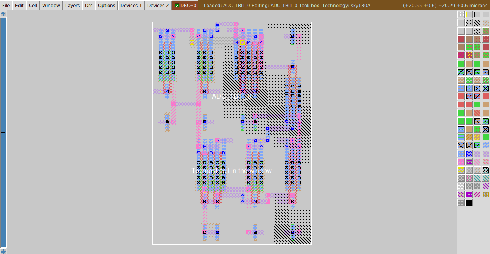
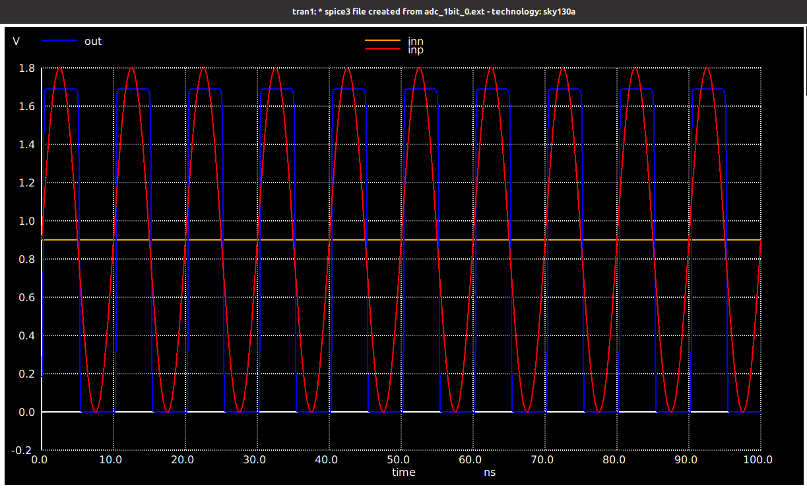
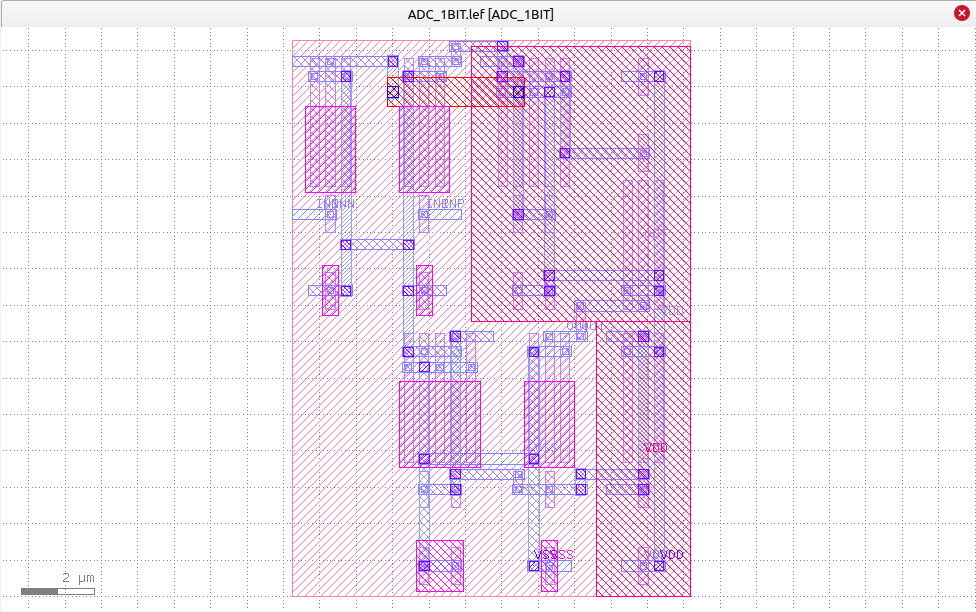
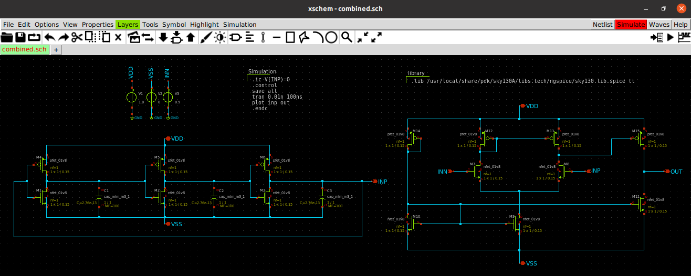

## Index
- [1-bit ADC (Analog to Digital Converter)](https://github.com/syedimaduddin/msvsd4bituc/tree/main/Week-5#1-bit-adc-analog-to-digital-converter)
    * [ADC Schematic using Xschem](https://github.com/syedimaduddin/msvsd4bituc/tree/main/Week-5#adc-schematic-using-xschem)
    * [Pre-Layout Simulation of 1-bit ADC](https://github.com/syedimaduddin/msvsd4bituc/tree/main/Week-5#pre-layout-simulation-of-1-bit-adc)
    * [ADC Layout using ALIGN Tool](https://github.com/syedimaduddin/msvsd4bituc/tree/main/Week-5#adc-layout-using-align-tool)
    * [Magic View ADC Layout generated from ALIGN](https://github.com/syedimaduddin/msvsd4bituc/tree/main/Week-5#magic-view-adc-layout-generated-from-align)
    * [Post-layout Simulation of 1-bit ADC](https://github.com/syedimaduddin/msvsd4bituc/tree/main/Week-5#post-layout-simulation-of-1-bit-adc)
    * [Lef & GDS File For OpenFASoC Flow](https://github.com/syedimaduddin/msvsd4bituc/edit/main/Week-5#lef--gds-file-for-openfasoc-flow)
    * [Result](https://github.com/syedimaduddin/msvsd4bituc/tree/main/Week-5#result)
- [Combined Ring Oscillator and ADC](https://github.com/syedimaduddin/msvsd4bituc/edit/main/Week-5#combined-ring-oscillator-and-adc)
    * [Combined Schematic using Xschem](https://github.com/syedimaduddin/msvsd4bituc/edit/main/Week-5#combined-schematic-using-xschem)
    * [Prelayout Simulation of Combined Circuit](https://github.com/syedimaduddin/msvsd4bituc/edit/main/Week-5#prelayout-simulation-of-combined-circuit)
- [OpenFASoC Flow Verilog File](https://github.com/syedimaduddin/msvsd4bituc/tree/main/Week-5#openfasoc-flow-verilog-file)
    * [Dummy Verilog For Top level](https://github.com/syedimaduddin/msvsd4bituc/tree/main/Week-5#dummy-verilog-for-top-level)
    * [Verilog code for Ring Oscillator](https://github.com/syedimaduddin/msvsd4bituc/edit/main/Week-5#verilog-code-for-ring-oscillator)
    * [Verilog code for 1-bit ADC](https://github.com/syedimaduddin/msvsd4bituc/edit/main/Week-5#verilog-code-for-1-bit-adc)

## 1-bit ADC (Analog to Digital Converter)

### ADC Schematic using Xschem


View the Netlist of 1-bit ADC generated by xschem, Click Here👇
<details><summary>Netlist</summary>

```
** sch_path: /home/syedimaduddin/Desktop/VSD_PD_Research_Program/Week-5/xschem/adc_1bit.sch
**.subckt adc_1bit VSS VDD OUT INN INP
*.iopin VSS
*.iopin VDD
*.opin OUT
*.ipin INN
*.ipin INP
XM1 net2 net1 VDD VDD sky130_fd_pr__pfet_01v8 L=0.15 W=2.1 nf=2 ad='int((nf+1)/2) * W/nf * 0.29' as='int((nf+2)/2) * W/nf * 0.29'
+ pd='2*int((nf+1)/2) * (W/nf + 0.29)' ps='2*int((nf+2)/2) * (W/nf + 0.29)' nrd='0.29 / W' nrs='0.29 / W'
+ sa=0 sb=0 sd=0 mult=1 m=1
XM2 OUT net2 VDD VDD sky130_fd_pr__pfet_01v8 L=0.15 W=2.1 nf=2 ad='int((nf+1)/2) * W/nf * 0.29' as='int((nf+2)/2) * W/nf * 0.29'
+ pd='2*int((nf+1)/2) * (W/nf + 0.29)' ps='2*int((nf+2)/2) * (W/nf + 0.29)' nrd='0.29 / W' nrs='0.29 / W'
+ sa=0 sb=0 sd=0 mult=1 m=1
XM3 net1 net1 VDD VDD sky130_fd_pr__pfet_01v8 L=0.15 W=2.1 nf=2 ad='int((nf+1)/2) * W/nf * 0.29' as='int((nf+2)/2) * W/nf * 0.29'
+ pd='2*int((nf+1)/2) * (W/nf + 0.29)' ps='2*int((nf+2)/2) * (W/nf + 0.29)' nrd='0.29 / W' nrs='0.29 / W'
+ sa=0 sb=0 sd=0 mult=1 m=1
XM4 net3 net3 VDD VDD sky130_fd_pr__pfet_01v8 L=0.15 W=2.1 nf=2 ad='int((nf+1)/2) * W/nf * 0.29' as='int((nf+2)/2) * W/nf * 0.29'
+ pd='2*int((nf+1)/2) * (W/nf + 0.29)' ps='2*int((nf+2)/2) * (W/nf + 0.29)' nrd='0.29 / W' nrs='0.29 / W'
+ sa=0 sb=0 sd=0 mult=1 m=1
XM5 net1 INN net4 net4 sky130_fd_pr__nfet_01v8 L=0.15 W=2.1 nf=2 ad='int((nf+1)/2) * W/nf * 0.29' as='int((nf+2)/2) * W/nf * 0.29'
+ pd='2*int((nf+1)/2) * (W/nf + 0.29)' ps='2*int((nf+2)/2) * (W/nf + 0.29)' nrd='0.29 / W' nrs='0.29 / W'
+ sa=0 sb=0 sd=0 mult=1 m=1
XM6 net2 INP net4 net4 sky130_fd_pr__nfet_01v8 L=0.15 W=2.1 nf=2 ad='int((nf+1)/2) * W/nf * 0.29' as='int((nf+2)/2) * W/nf * 0.29'
+ pd='2*int((nf+1)/2) * (W/nf + 0.29)' ps='2*int((nf+2)/2) * (W/nf + 0.29)' nrd='0.29 / W' nrs='0.29 / W'
+ sa=0 sb=0 sd=0 mult=1 m=1
XM7 net4 net3 VSS VSS sky130_fd_pr__nfet_01v8 L=0.15 W=2.1 nf=2 ad='int((nf+1)/2) * W/nf * 0.29' as='int((nf+2)/2) * W/nf * 0.29'
+ pd='2*int((nf+1)/2) * (W/nf + 0.29)' ps='2*int((nf+2)/2) * (W/nf + 0.29)' nrd='0.29 / W' nrs='0.29 / W'
+ sa=0 sb=0 sd=0 mult=1 m=1
XM8 OUT net3 VSS VSS sky130_fd_pr__nfet_01v8 L=0.15 W=2.1 nf=2 ad='int((nf+1)/2) * W/nf * 0.29' as='int((nf+2)/2) * W/nf * 0.29'
+ pd='2*int((nf+1)/2) * (W/nf + 0.29)' ps='2*int((nf+2)/2) * (W/nf + 0.29)' nrd='0.29 / W' nrs='0.29 / W'
+ sa=0 sb=0 sd=0 mult=1 m=1
XM9 net3 net3 VSS VSS sky130_fd_pr__nfet_01v8 L=0.15 W=2.1 nf=2 ad='int((nf+1)/2) * W/nf * 0.29' as='int((nf+2)/2) * W/nf * 0.29'
+ pd='2*int((nf+1)/2) * (W/nf + 0.29)' ps='2*int((nf+2)/2) * (W/nf + 0.29)' nrd='0.29 / W' nrs='0.29 / W'
+ sa=0 sb=0 sd=0 mult=1 m=1
V1 VDD GND 1.8
.save i(v1)
V2 VSS GND 0
.save i(v2)
V3 INP GND sin(0.9 0.9 100Meg)
.save i(v3)
V4 INN GND 0.9
.save i(v4)
**** begin user architecture code
.lib /usr/local/share/pdk/sky130A/libs.tech/ngspice/sky130.lib.spice tt
.control
save all
tran 0.01n 100n
plot inp out inn
.endc
**** end user architecture code
**.ends
.GLOBAL GND
.end
```
</details>

### Pre-Layout Simulation of 1-bit ADC


### ADC Layout using ALIGN Tool
Netlist used for conversion from schematic to layout using ALIGN
```
.subckt adc_1bit VSS VDD OUT INN INP
XM1 net2 net1 VDD VDD sky130_fd_pr__pfet_01v8 L=150e-9 W=10.5e-7 nf=2
XM2 OUT net2 VDD VDD sky130_fd_pr__pfet_01v8 L=150e-9 W=10.5e-7 nf=2
XM3 net1 net1 VDD VDD sky130_fd_pr__pfet_01v8 L=150e-9 W=10.5e-7 nf=2
XM4 net3 net3 VDD VDD sky130_fd_pr__pfet_01v8 L=150e-9 W=10.5e-7 nf=2
XM5 net1 INN net4 net4 sky130_fd_pr__nfet_01v8 L=150e-9 W=10.5e-7 nf=2
XM6 net2 INP net4 net4 sky130_fd_pr__nfet_01v8 L=150e-9 W=10.5e-7 nf=2
XM7 net4 net3 VSS VSS sky130_fd_pr__nfet_01v8 L=150e-9 W=10.5e-7 nf=2
XM8 OUT net3 VSS VSS sky130_fd_pr__nfet_01v8 L=150e-9 W=10.5e-7 nf=2
XM9 net3 net3 VSS VSS sky130_fd_pr__nfet_01v8 L=150e-9 W=10.5e-7 nf=2
.ends adc_1bit
```

### Magic View ADC Layout generated from ALIGN



Extract the netlist of above ADC Layout from magic using the following commands

```
extract do local
extract all
ext2spice hierarchy off
ext2spice scale off
ext2spice cthresh 0 rthresh 0
ext2spice 
```
View extracted Netlist from magic, Click Here👇
<details><summary>Netlist</summary>

```
* SPICE3 file created from ADC_1BIT_0.ext - technology: sky130A
X1 VSS VDD OUT INN INP adc_1bit
V1 VDD GND 1.8
.save i(v1)
V2 VSS GND 0
.save i(v2)
V3 INP GND sin(0.9 0.9 100Meg)
.save i(v3)
V4 INN GND 0.9
.save i(v4)
**** begin user architecture code
.lib /usr/local/share/pdk/sky130A/libs.tech/ngspice/sky130.lib.spice tt
.control
save all
tran 0.01n 100n
plot inp out inn
.endc
**** end user architecture code
.subckt adc_1bit VSS VDD OUT INN INP
X12 li_921_2923# m1_258_2912# VDD VDD sky130_fd_pr__pfet_01v8 ad=5.88e+11p pd=4.76e+06u as=0p ps=0u w=2.1e+06u l=150000u
X13 VDD m1_258_2912# li_921_2923# VDD sky130_fd_pr__pfet_01v8 ad=0p pd=0u as=0p ps=0u w=2.1e+06u l=150000u
X2 OUT li_921_2923# VDD VDD sky130_fd_pr__pfet_01v8 ad=5.88e+11p pd=4.76e+06u as=0p ps=0u w=2.1e+06u l=150000u
X3 VDD li_921_2923# OUT VDD sky130_fd_pr__pfet_01v8 ad=0p pd=0u as=0p ps=0u w=2.1e+06u l=150000u
X10 m1_258_2912# m1_258_2912# VDD VDD sky130_fd_pr__pfet_01v8 ad=5.88e+11p pd=4.76e+06u as=0p ps=0u w=2.1e+06u l=150000u
X11 VDD m1_258_2912# m1_258_2912# VDD sky130_fd_pr__pfet_01v8 ad=0p pd=0u as=0p ps=0u w=2.1e+06u l=150000u
X0 m1_1602_560# m1_1602_560# VDD VDD sky130_fd_pr__pfet_01v8 ad=5.88e+11p pd=4.76e+06u as=3.927e+12p ps=3.314e+07u w=2.1e+06u l=150000u
X1 VDD m1_1602_560# m1_1602_560# VDD sky130_fd_pr__pfet_01v8 ad=0p pd=0u as=0p ps=0u w=2.1e+06u l=150000u
X16 m1_258_2912# INN net4 net4 sky130_fd_pr__nfet_01v8 ad=5.88e+11p pd=4.76e+06u as=0p ps=0u w=2.1e+06u l=150000u
X17 net4 INN m1_258_2912# net4 sky130_fd_pr__nfet_01v8 ad=0p pd=0u as=0p ps=0u w=2.1e+06u l=150000u
X14 li_921_2923# INP net4 net4 sky130_fd_pr__nfet_01v8 ad=5.88e+11p pd=4.76e+06u as=0p ps=0u w=2.1e+06u l=150000u
X15 net4 INP li_921_2923# net4 sky130_fd_pr__nfet_01v8 ad=0p pd=0u as=0p ps=0u w=2.1e+06u l=150000u
X8 net4 m1_1602_560# VSS VSS sky130_fd_pr__nfet_01v8 ad=0p pd=0u as=0p ps=0u w=2.1e+06u l=150000u
X9 VSS m1_1602_560# net4 VSS sky130_fd_pr__nfet_01v8 ad=0p pd=0u as=0p ps=0u w=2.1e+06u l=150000u
X4 OUT m1_1602_560# VSS VSS sky130_fd_pr__nfet_01v8 ad=5.88e+11p pd=4.76e+06u as=5.628e+12p ps=4.736e+07u w=2.1e+06u l=150000u
X5 VSS m1_1602_560# OUT VSS sky130_fd_pr__nfet_01v8 ad=0p pd=0u as=0p ps=0u w=2.1e+06u l=150000u
X6 m1_1602_560# m1_1602_560# VSS VSS sky130_fd_pr__nfet_01v8 ad=5.88e+11p pd=4.76e+06u as=0p ps=0u w=2.1e+06u l=150000u
X7 VSS m1_1602_560# m1_1602_560# VSS sky130_fd_pr__nfet_01v8 ad=0p pd=0u as=0p ps=0u w=2.1e+06u l=150000u
C0 OUT VDD 0.87fF
C1 INP m1_258_2912# 0.06fF
C2 INN net4 0.00fF
C3 net4 li_921_2923# 0.03fF
C4 INN INP 0.03fF
C5 m1_1602_560# OUT 0.10fF
C6 INP VSS 0.05fF
C7 net4 VDD 0.02fF
C8 net4 OUT 0.02fF
C9 INP li_921_2923# 0.00fF
C10 m1_1602_560# m1_258_2912# 0.01fF
C11 INP VDD 0.03fF
C12 m1_1602_560# VSS 0.17fF
C13 OUT m1_258_2912# 0.00fF
C14 m1_1602_560# li_921_2923# 0.01fF
C15 m1_1602_560# VDD 2.27fF
C16 INP net4 0.00fF
C17 m1_1602_560# OUT 0.11fF
C18 VSS OUT 0.01fF
C19 INN m1_258_2912# 0.00fF
C20 VSS m1_258_2912# 0.21fF
C21 li_921_2923# m1_258_2912# 0.62fF
C22 VDD OUT 0.27fF
C23 m1_1602_560# net4 0.98fF
C24 INN m1_258_2912# 0.09fF
C25 INN VSS 0.00fF
C26 VDD m1_258_2912# 2.30fF
C27 m1_1602_560# INP 0.01fF
C28 INN li_921_2923# 0.00fF
C29 VSS li_921_2923# 0.02fF
C30 INN VDD 0.00fF
C31 INP li_921_2923# 0.09fF
C32 VSS VDD 0.52fF
C33 VDD li_921_2923# 2.39fF
C34 OUT li_921_2923# 0.09fF
C35 net4 m1_258_2912# 0.31fF
C36 VDD 0 9.15fF
C37 net4 0 0.59fF
C38 m1_258_2912# 0 0.94fF
C39 INN 0 0.64fF
C40 INP 0 0.64fF
C41 m1_1602_560# 0 1.79fF
C42 OUT 0 0.91fF
C43 li_921_2923# 0 0.56fF
.ends
```
</details>

<br>

### Post-layout Simulation of 1-bit ADC


#### Lef & GDS File For OpenFASoC Flow
|.gds|.lef|
|-|-|
|| |


### Result of 1-bit ADC Prelayout and Post layout Simulation
Prelayout simulation using xschem and postlayout simulation using ALIGN of 1-bit analog to digital converter is same.


## Combined Ring Oscillator and ADC

### Combined Schematic using Xschem


### Prelayout simulation of combined circuit


View the Netlist of combined circuit of Ring Oscillator and 1-bit ADC generated by xschem, Click Here👇
<details><summary>Netlist</summary>

```
** sch_path: /home/syedimaduddin/Desktop/VSD_PD_Research_Program/Week-5/xschem/combined.sch
**.subckt combined VDD VSS INP VDD VSS OUT INN INP
*.iopin VDD
*.iopin VSS
*.opin INP
*.iopin VDD
*.iopin VSS
*.opin OUT
*.ipin INN
*.ipin INP
V1 VDD GND 1.8
.save i(v1)
V2 VSS GND 0
.save i(v2)
XM1 net1 INP VSS VSS sky130_fd_pr__nfet_01v8 L=0.15 W=1 nf=1 ad='int((nf+1)/2) * W/nf * 0.29' as='int((nf+2)/2) * W/nf * 0.29'
+ pd='2*int((nf+1)/2) * (W/nf + 0.29)' ps='2*int((nf+2)/2) * (W/nf + 0.29)' nrd='0.29 / W' nrs='0.29 / W'
+ sa=0 sb=0 sd=0 mult=1 m=1
XM2 net2 net1 VSS VSS sky130_fd_pr__nfet_01v8 L=0.15 W=1 nf=1 ad='int((nf+1)/2) * W/nf * 0.29' as='int((nf+2)/2) * W/nf * 0.29'
+ pd='2*int((nf+1)/2) * (W/nf + 0.29)' ps='2*int((nf+2)/2) * (W/nf + 0.29)' nrd='0.29 / W' nrs='0.29 / W'
+ sa=0 sb=0 sd=0 mult=1 m=1
XM3 INP net2 VSS VSS sky130_fd_pr__nfet_01v8 L=0.15 W=1 nf=1 ad='int((nf+1)/2) * W/nf * 0.29' as='int((nf+2)/2) * W/nf * 0.29'
+ pd='2*int((nf+1)/2) * (W/nf + 0.29)' ps='2*int((nf+2)/2) * (W/nf + 0.29)' nrd='0.29 / W' nrs='0.29 / W'
+ sa=0 sb=0 sd=0 mult=1 m=1
XM4 net1 INP VDD VDD sky130_fd_pr__pfet_01v8 L=0.15 W=1 nf=1 ad='int((nf+1)/2) * W/nf * 0.29' as='int((nf+2)/2) * W/nf * 0.29'
+ pd='2*int((nf+1)/2) * (W/nf + 0.29)' ps='2*int((nf+2)/2) * (W/nf + 0.29)' nrd='0.29 / W' nrs='0.29 / W'
+ sa=0 sb=0 sd=0 mult=1 m=1
XM5 net2 net1 VDD VDD sky130_fd_pr__pfet_01v8 L=0.15 W=1 nf=1 ad='int((nf+1)/2) * W/nf * 0.29' as='int((nf+2)/2) * W/nf * 0.29'
+ pd='2*int((nf+1)/2) * (W/nf + 0.29)' ps='2*int((nf+2)/2) * (W/nf + 0.29)' nrd='0.29 / W' nrs='0.29 / W'
+ sa=0 sb=0 sd=0 mult=1 m=1
XM6 INP net2 VDD VDD sky130_fd_pr__pfet_01v8 L=0.15 W=1 nf=1 ad='int((nf+1)/2) * W/nf * 0.29' as='int((nf+2)/2) * W/nf * 0.29'
+ pd='2*int((nf+1)/2) * (W/nf + 0.29)' ps='2*int((nf+2)/2) * (W/nf + 0.29)' nrd='0.29 / W' nrs='0.29 / W'
+ sa=0 sb=0 sd=0 mult=1 m=1
XM7 net5 INN net3 net3 sky130_fd_pr__nfet_01v8 L=0.15 W=1 nf=1 ad='int((nf+1)/2) * W/nf * 0.29' as='int((nf+2)/2) * W/nf * 0.29'
+ pd='2*int((nf+1)/2) * (W/nf + 0.29)' ps='2*int((nf+2)/2) * (W/nf + 0.29)' nrd='0.29 / W' nrs='0.29 / W'
+ sa=0 sb=0 sd=0 mult=1 m=1
XM8 net6 INP net3 net3 sky130_fd_pr__nfet_01v8 L=0.15 W=1 nf=1 ad='int((nf+1)/2) * W/nf * 0.29' as='int((nf+2)/2) * W/nf * 0.29'
+ pd='2*int((nf+1)/2) * (W/nf + 0.29)' ps='2*int((nf+2)/2) * (W/nf + 0.29)' nrd='0.29 / W' nrs='0.29 / W'
+ sa=0 sb=0 sd=0 mult=1 m=1
XM9 net3 net4 VSS VSS sky130_fd_pr__nfet_01v8 L=0.15 W=1 nf=1 ad='int((nf+1)/2) * W/nf * 0.29' as='int((nf+2)/2) * W/nf * 0.29'
+ pd='2*int((nf+1)/2) * (W/nf + 0.29)' ps='2*int((nf+2)/2) * (W/nf + 0.29)' nrd='0.29 / W' nrs='0.29 / W'
+ sa=0 sb=0 sd=0 mult=1 m=1
XM10 net4 net4 VSS VSS sky130_fd_pr__nfet_01v8 L=0.15 W=1 nf=1 ad='int((nf+1)/2) * W/nf * 0.29' as='int((nf+2)/2) * W/nf * 0.29'
+ pd='2*int((nf+1)/2) * (W/nf + 0.29)' ps='2*int((nf+2)/2) * (W/nf + 0.29)' nrd='0.29 / W' nrs='0.29 / W'
+ sa=0 sb=0 sd=0 mult=1 m=1
XM11 OUT net4 VSS VSS sky130_fd_pr__nfet_01v8 L=0.15 W=1 nf=1 ad='int((nf+1)/2) * W/nf * 0.29' as='int((nf+2)/2) * W/nf * 0.29'
+ pd='2*int((nf+1)/2) * (W/nf + 0.29)' ps='2*int((nf+2)/2) * (W/nf + 0.29)' nrd='0.29 / W' nrs='0.29 / W'
+ sa=0 sb=0 sd=0 mult=1 m=1
XM12 net5 net5 VDD VDD sky130_fd_pr__pfet_01v8 L=0.15 W=1 nf=1 ad='int((nf+1)/2) * W/nf * 0.29' as='int((nf+2)/2) * W/nf * 0.29'
+ pd='2*int((nf+1)/2) * (W/nf + 0.29)' ps='2*int((nf+2)/2) * (W/nf + 0.29)' nrd='0.29 / W' nrs='0.29 / W'
+ sa=0 sb=0 sd=0 mult=1 m=1
XM13 net6 net5 VDD VDD sky130_fd_pr__pfet_01v8 L=0.15 W=1 nf=1 ad='int((nf+1)/2) * W/nf * 0.29' as='int((nf+2)/2) * W/nf * 0.29'
+ pd='2*int((nf+1)/2) * (W/nf + 0.29)' ps='2*int((nf+2)/2) * (W/nf + 0.29)' nrd='0.29 / W' nrs='0.29 / W'
+ sa=0 sb=0 sd=0 mult=1 m=1
XM14 net4 net4 VDD VDD sky130_fd_pr__pfet_01v8 L=0.15 W=1 nf=1 ad='int((nf+1)/2) * W/nf * 0.29' as='int((nf+2)/2) * W/nf * 0.29'
+ pd='2*int((nf+1)/2) * (W/nf + 0.29)' ps='2*int((nf+2)/2) * (W/nf + 0.29)' nrd='0.29 / W' nrs='0.29 / W'
+ sa=0 sb=0 sd=0 mult=1 m=1
XM15 OUT net6 VDD VDD sky130_fd_pr__pfet_01v8 L=0.15 W=1 nf=1 ad='int((nf+1)/2) * W/nf * 0.29' as='int((nf+2)/2) * W/nf * 0.29'
+ pd='2*int((nf+1)/2) * (W/nf + 0.29)' ps='2*int((nf+2)/2) * (W/nf + 0.29)' nrd='0.29 / W' nrs='0.29 / W'
+ sa=0 sb=0 sd=0 mult=1 m=1
V3 INN GND 0.9
.save i(v3)
XC1 net1 VSS sky130_fd_pr__cap_mim_m3_1 W=1 L=1 MF=100 m=100
XC2 net2 VSS sky130_fd_pr__cap_mim_m3_1 W=1 L=1 MF=100 m=100
XC3 INP VSS sky130_fd_pr__cap_mim_m3_1 W=1 L=1 MF=100 m=100
**** begin user architecture code
.lib /usr/local/share/pdk/sky130A/libs.tech/ngspice/sky130.lib.spice tt
.ic V(INP)=0
.control
save all
tran 0.01n 100ns
plot inp out
.endc
**** end user architecture code
**.ends
.GLOBAL GND
.end
```
</details>

### Result of Prelayout simulation of combined circuit
As shown in the above image of prelayout simulation, the combined circuit of Ring Oscillator and 1-bit ADC works correctly.


## OpenFASoC Flow Verilog File

### Dummy Verilog For Top level
```verilog
module msvsd4bituc(
    input vdd,
    input vss,
    input inn,
    output out
);

wire ring_adc;

ring_oscillator ring_osc (
    .vdd(vdd),
    .vss(vss),
    .inp(ring_adc)
);

adc_1bit adc (
    .vdd(vdd),
    .vss(vss),
    .inn(inn),
    .inp(ring_adc),
    .out(out)
);

endmodule
```

#### Verilog code for Ring Oscillator
```verilog
module ring_oscillator(
    input vdd,
    input vss,
    output inp
);

endmodule
```

#### Verilog code for 1-bit ADC
```verilog
module adc_1bit(
    input vdd,
    input vss,
    input inn,
    input inp,
    output out
);

endmodule
```

