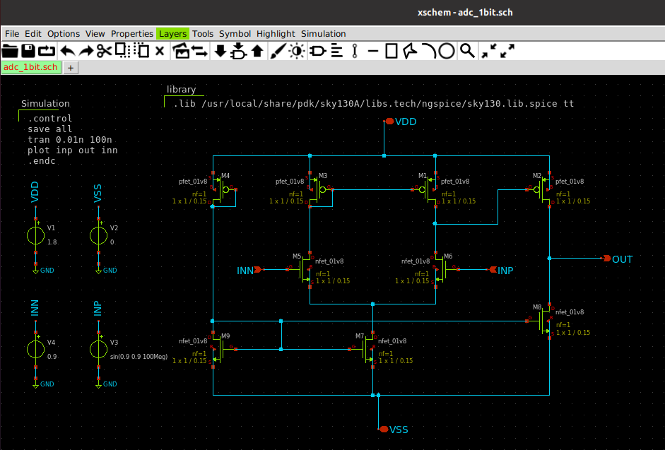

## Index
- [1-bit ADC (Analog to Digital Converter)](https://github.com/syedimaduddin/msvsd4bituc/tree/main/Week-5#1-bit-adc-analog-to-digital-converter)
    * [ADC Schematic using Xschem](https://github.com/syedimaduddin/msvsd4bituc/tree/main/Week-5#adc-schematic-using-xschem)
    * [Pre-Layout Simulation of 1-bit ADC](https://github.com/syedimaduddin/msvsd4bituc/tree/main/Week-5#pre-layout-simulation-of-1-bit-adc)
    * [ADC Layout using ALIGN Tool](https://github.com/syedimaduddin/msvsd4bituc/tree/main/Week-5#adc-layout-using-align-tool)
    * [Magic View ADC Layout generated from ALIGN](https://github.com/syedimaduddin/msvsd4bituc/tree/main/Week-5#magic-view-adc-layout-generated-from-align)
    * [Post-layout Simulation of 1-bit ADC](https://github.com/syedimaduddin/msvsd4bituc/tree/main/Week-5#post-layout-simulation-of-1-bit-adc)
    * [Lef & GDS File For OpenFASoC Flow](https://github.com/syedimaduddin/msvsd4bituc/edit/main/Week-5#lef--gds-file-for-openfasoc-flow)
    * [Result](https://github.com/syedimaduddin/msvsd4bituc/tree/main/Week-5#result)
- [Combined Ring Oscillator and ADC](https://github.com/syedimaduddin/msvsd4bituc/edit/main/Week-5#combined-ring-oscillator-and-adc)
    * [Combined Schematic using Xschem](https://github.com/syedimaduddin/msvsd4bituc/edit/main/Week-5#combined-schematic-using-xschem)
    * [Prelayout Simulation of Combined Circuit](https://github.com/syedimaduddin/msvsd4bituc/edit/main/Week-5#prelayout-simulation-of-combined-circuit)
- [OpenFASoC Flow Verilog File](https://github.com/syedimaduddin/msvsd4bituc/tree/main/Week-5#openfasoc-flow-verilog-file)
    * [Dummy Verilog For Top level](https://github.com/syedimaduddin/msvsd4bituc/tree/main/Week-5#dummy-verilog-for-top-level)
    * [Verilog code for Ring Oscillator](https://github.com/syedimaduddin/msvsd4bituc/edit/main/Week-5#verilog-code-for-ring-oscillator)
    * [Verilog code for 1-bit ADC](https://github.com/syedimaduddin/msvsd4bituc/edit/main/Week-5#verilog-code-for-1-bit-adc)

## 1-bit ADC (Analog to Digital Converter)

### ADC Schematic using Xschem


View the Netlist of 1-bit ADC generated by xschem, Click Here👇
<details><summary>Netlist</summary>

```
** sch_path: /home/syedimaduddin/Desktop/VSD_PD_Research_Program/Week-5/xschem/adc_1bit.sch
**.subckt adc_1bit VSS VDD OUT INN INP
*.iopin VSS
*.iopin VDD
*.opin OUT
*.ipin INN
*.ipin INP
XM1 net2 net1 VDD VDD sky130_fd_pr__pfet_01v8 L=0.15 W=1 nf=1 ad='int((nf+1)/2) * W/nf * 0.29' as='int((nf+2)/2) * W/nf * 0.29'
+ pd='2*int((nf+1)/2) * (W/nf + 0.29)' ps='2*int((nf+2)/2) * (W/nf + 0.29)' nrd='0.29 / W' nrs='0.29 / W'
+ sa=0 sb=0 sd=0 mult=1 m=1
XM2 OUT net2 VDD VDD sky130_fd_pr__pfet_01v8 L=0.15 W=1 nf=1 ad='int((nf+1)/2) * W/nf * 0.29' as='int((nf+2)/2) * W/nf * 0.29'
+ pd='2*int((nf+1)/2) * (W/nf + 0.29)' ps='2*int((nf+2)/2) * (W/nf + 0.29)' nrd='0.29 / W' nrs='0.29 / W'
+ sa=0 sb=0 sd=0 mult=1 m=1
XM3 net1 net1 VDD VDD sky130_fd_pr__pfet_01v8 L=0.15 W=1 nf=1 ad='int((nf+1)/2) * W/nf * 0.29' as='int((nf+2)/2) * W/nf * 0.29'
+ pd='2*int((nf+1)/2) * (W/nf + 0.29)' ps='2*int((nf+2)/2) * (W/nf + 0.29)' nrd='0.29 / W' nrs='0.29 / W'
+ sa=0 sb=0 sd=0 mult=1 m=1
XM4 net3 net3 VDD VDD sky130_fd_pr__pfet_01v8 L=0.15 W=1 nf=1 ad='int((nf+1)/2) * W/nf * 0.29' as='int((nf+2)/2) * W/nf * 0.29'
+ pd='2*int((nf+1)/2) * (W/nf + 0.29)' ps='2*int((nf+2)/2) * (W/nf + 0.29)' nrd='0.29 / W' nrs='0.29 / W'
+ sa=0 sb=0 sd=0 mult=1 m=1
XM5 net1 INN net4 net4 sky130_fd_pr__nfet_01v8 L=0.15 W=1 nf=1 ad='int((nf+1)/2) * W/nf * 0.29' as='int((nf+2)/2) * W/nf * 0.29'
+ pd='2*int((nf+1)/2) * (W/nf + 0.29)' ps='2*int((nf+2)/2) * (W/nf + 0.29)' nrd='0.29 / W' nrs='0.29 / W'
+ sa=0 sb=0 sd=0 mult=1 m=1
XM6 net2 INP net4 net4 sky130_fd_pr__nfet_01v8 L=0.15 W=1 nf=1 ad='int((nf+1)/2) * W/nf * 0.29' as='int((nf+2)/2) * W/nf * 0.29'
+ pd='2*int((nf+1)/2) * (W/nf + 0.29)' ps='2*int((nf+2)/2) * (W/nf + 0.29)' nrd='0.29 / W' nrs='0.29 / W'
+ sa=0 sb=0 sd=0 mult=1 m=1
XM7 net4 net3 VSS VSS sky130_fd_pr__nfet_01v8 L=0.15 W=1 nf=1 ad='int((nf+1)/2) * W/nf * 0.29' as='int((nf+2)/2) * W/nf * 0.29'
+ pd='2*int((nf+1)/2) * (W/nf + 0.29)' ps='2*int((nf+2)/2) * (W/nf + 0.29)' nrd='0.29 / W' nrs='0.29 / W'
+ sa=0 sb=0 sd=0 mult=1 m=1
XM8 OUT net3 VSS VSS sky130_fd_pr__nfet_01v8 L=0.15 W=1 nf=1 ad='int((nf+1)/2) * W/nf * 0.29' as='int((nf+2)/2) * W/nf * 0.29'
+ pd='2*int((nf+1)/2) * (W/nf + 0.29)' ps='2*int((nf+2)/2) * (W/nf + 0.29)' nrd='0.29 / W' nrs='0.29 / W'
+ sa=0 sb=0 sd=0 mult=1 m=1
XM9 net3 net3 VSS VSS sky130_fd_pr__nfet_01v8 L=0.15 W=1 nf=1 ad='int((nf+1)/2) * W/nf * 0.29' as='int((nf+2)/2) * W/nf * 0.29'
+ pd='2*int((nf+1)/2) * (W/nf + 0.29)' ps='2*int((nf+2)/2) * (W/nf + 0.29)' nrd='0.29 / W' nrs='0.29 / W'
+ sa=0 sb=0 sd=0 mult=1 m=1
V1 VDD GND 1.8
.save i(v1)
V2 VSS GND 0
.save i(v2)
V3 INP GND sin(0.9 0.9 100Meg)
.save i(v3)
V4 INN GND 0.9
.save i(v4)
**** begin user architecture code
.lib /usr/local/share/pdk/sky130A/libs.tech/ngspice/sky130.lib.spice tt
.control
save all
tran 0.01n 100n
plot inp out inn
.endc
**** end user architecture code
**.ends
.GLOBAL GND
.end
```
</details>

### Pre-Layout Simulation of 1-bit ADC


### ADC Layout using ALIGN Tool
Netlist used for conversion from schematic to layout using ALIGN
```
.subckt adc_1bit VREF VIN OUT VDD VSS
XM1 net2 net1 VDD VDD sky130_fd_pr__pfet_01v8 w=21e-7 l=150e-9 nf=2
XM2 OUT net2 VDD VDD sky130_fd_pr__pfet_01v8 w=21e-7 l=150e-9 nf=2
XM3 net1 net1 VDD VDD sky130_fd_pr__pfet_01v8 w=21e-7 l=150e-9 nf=2
XM4 net3 net3 VDD VDD sky130_fd_pr__pfet_01v8 w=21e-7 l=150e-9 nf=2
XM5 net1 VREF net4 net4 sky130_fd_pr__nfet_01v8 w=21e-7 l=150e-9 nf=2 m=4
XM6 net2 VIN net4 net4 sky130_fd_pr__nfet_01v8 w=21e-7 l=150e-9 nf=2 m=8
XM7 net4 net3 VSS VSS sky130_fd_pr__nfet_01v8 w=21e-7 l=150e-9 nf=2
XM8 OUT net3 VSS VSS sky130_fd_pr__nfet_01v8 w=21e-7 l=150e-9 nf=2
XM9 net3 net3 VSS VSS sky130_fd_pr__nfet_01v8 w=21e-7 l=150e-9 nf=2
.ends adc_1bit
```

### Magic View ADC Layout generated from ALIGN


Extract the netlist of above ADC Layout from magic using the following commands

```
extract do local
extract all
ext2spice hierarchy off
ext2spice scale off
ext2spice cthresh 0 rthresh 0
ext2spice 
```
View extracted Netlist from magic, Click Here👇
<details><summary>Netlist</summary>

```
* SPICE3 file created from ADC_1BIT_0.ext - technology: sky130A
V1 VDD GND 1.8
.save i(v1)
V2 VSS GND 0
.save i(v2)
V3 VIN GND sin(0.9 0.9 50Meg 0 0 0)
.save i(v3)
V4 VREF GND 0.9
.save i(v4)
x1 VSS VDD OUT VREF VIN adc_1bit
**** begin user architecture code
.lib /usr/local/share/pdk/sky130A/libs.tech/ngspice/sky130.lib.spice tt
.control
save all
tran 0.01n 100n
plot vin out vref
.endc
**** end user architecture code
.subckt adc_1bit VSS VDD OUT VREF VIN
X0 m1_226_1568# m1_226_1568# m1_398_728# m1_398_728# sky130_fd_pr__pfet_01v8 ad=5.88e+11p pd=4.76e+06u as=3.927e+12p ps=3.314e+07u w=2.1e+06u l=150000u
X1 m1_398_728# m1_226_1568# m1_226_1568# m1_398_728# sky130_fd_pr__pfet_01v8 ad=0p pd=0u as=0p ps=0u w=2.1e+06u l=150000u
X2 li_663_571# m1_226_1568# m1_398_728# m1_398_728# sky130_fd_pr__pfet_01v8 ad=5.88e+11p pd=4.76e+06u as=0p ps=0u w=2.1e+06u l=150000u
X3 m1_398_728# m1_226_1568# li_663_571# m1_398_728# sky130_fd_pr__pfet_01v8 ad=0p pd=0u as=0p ps=0u w=2.1e+06u l=150000u
X4 m1_1430_644# m1_1430_644# m1_398_728# m1_398_728# sky130_fd_pr__pfet_01v8 ad=5.88e+11p pd=4.76e+06u as=0p ps=0u w=2.1e+06u l=150000u
X5 m1_398_728# m1_1430_644# m1_1430_644# m1_398_728# sky130_fd_pr__pfet_01v8 ad=0p pd=0u as=0p ps=0u w=2.1e+06u l=150000u
X6 li_663_571# VIN VSUBS VSUBS sky130_fd_pr__nfet_01v8 ad=4.704e+12p pd=3.808e+07u as=1.1508e+13p ps=9.496e+07u w=2.1e+06u l=150000u
X7 VSUBS VIN li_663_571# VSUBS sky130_fd_pr__nfet_01v8 ad=0p pd=0u as=0p ps=0u w=2.1e+06u l=150000u
X8 VSUBS VIN li_663_571# VSUBS sky130_fd_pr__nfet_01v8 ad=0p pd=0u as=0p ps=0u w=2.1e+06u l=150000u
X9 li_663_571# VIN VSUBS VSUBS sky130_fd_pr__nfet_01v8 ad=0p pd=0u as=0p ps=0u w=2.1e+06u l=150000u
X10 VSUBS VIN li_663_571# VSUBS sky130_fd_pr__nfet_01v8 ad=0p pd=0u as=0p ps=0u w=2.1e+06u l=150000u
X11 VSUBS VIN li_663_571# VSUBS sky130_fd_pr__nfet_01v8 ad=0p pd=0u as=0p ps=0u w=2.1e+06u l=150000u
X12 li_663_571# VIN VSUBS VSUBS sky130_fd_pr__nfet_01v8 ad=0p pd=0u as=0p ps=0u w=2.1e+06u l=150000u
X13 li_663_571# VIN VSUBS VSUBS sky130_fd_pr__nfet_01v8 ad=0p pd=0u as=0p ps=0u w=2.1e+06u l=150000u
X14 VSUBS VIN li_663_571# VSUBS sky130_fd_pr__nfet_01v8 ad=0p pd=0u as=0p ps=0u w=2.1e+06u l=150000u
X15 li_663_571# VIN VSUBS VSUBS sky130_fd_pr__nfet_01v8 ad=0p pd=0u as=0p ps=0u w=2.1e+06u l=150000u
X16 li_663_571# VIN VSUBS VSUBS sky130_fd_pr__nfet_01v8 ad=0p pd=0u as=0p ps=0u w=2.1e+06u l=150000u
X17 VSUBS VIN li_663_571# VSUBS sky130_fd_pr__nfet_01v8 ad=0p pd=0u as=0p ps=0u w=2.1e+06u l=150000u
X18 VSUBS VIN li_663_571# VSUBS sky130_fd_pr__nfet_01v8 ad=0p pd=0u as=0p ps=0u w=2.1e+06u l=150000u
X19 VSUBS VIN li_663_571# VSUBS sky130_fd_pr__nfet_01v8 ad=0p pd=0u as=0p ps=0u w=2.1e+06u l=150000u
X20 li_663_571# VIN VSUBS VSUBS sky130_fd_pr__nfet_01v8 ad=0p pd=0u as=0p ps=0u w=2.1e+06u l=150000u
X21 li_663_571# VIN VSUBS VSUBS sky130_fd_pr__nfet_01v8 ad=0p pd=0u as=0p ps=0u w=2.1e+06u l=150000u
X22 OUT m1_1430_644# VSUBS VSUBS sky130_fd_pr__nfet_01v8 ad=5.88e+11p pd=4.76e+06u as=0p ps=0u w=2.1e+06u l=150000u
X23 VSUBS m1_1430_644# OUT VSUBS sky130_fd_pr__nfet_01v8 ad=0p pd=0u as=0p ps=0u w=2.1e+06u l=150000u
X24 m1_1430_644# m1_1430_644# VSUBS VSUBS sky130_fd_pr__nfet_01v8 ad=5.88e+11p pd=4.76e+06u as=0p ps=0u w=2.1e+06u l=150000u
X25 VSUBS m1_1430_644# m1_1430_644# VSUBS sky130_fd_pr__nfet_01v8 ad=0p pd=0u as=0p ps=0u w=2.1e+06u l=150000u
X26 VSUBS m1_1430_644# VSUBS VSUBS sky130_fd_pr__nfet_01v8 ad=0p pd=0u as=0p ps=0u w=2.1e+06u l=150000u
X27 VSUBS m1_1430_644# VSUBS VSUBS sky130_fd_pr__nfet_01v8 ad=0p pd=0u as=0p ps=0u w=2.1e+06u l=150000u
X28 m1_226_1568# NMOS_S_4702537_X4_Y1_1679068307_0/a_200_252# VSUBS VSUBS sky130_fd_pr__nfet_01v8 ad=2.352e+12p pd=1.904e+07u as=0p ps=0u w=2.1e+06u l=150000u
X29 m1_226_1568# NMOS_S_4702537_X4_Y1_1679068307_0/a_200_252# VSUBS VSUBS sky130_fd_pr__nfet_01v8 ad=0p pd=0u as=0p ps=0u w=2.1e+06u l=150000u
X30 VSUBS NMOS_S_4702537_X4_Y1_1679068307_0/a_200_252# m1_226_1568# VSUBS sky130_fd_pr__nfet_01v8 ad=0p pd=0u as=0p ps=0u w=2.1e+06u l=150000u
X31 VSUBS NMOS_S_4702537_X4_Y1_1679068307_0/a_200_252# m1_226_1568# VSUBS sky130_fd_pr__nfet_01v8 ad=0p pd=0u as=0p ps=0u w=2.1e+06u l=150000u
X32 m1_226_1568# NMOS_S_4702537_X4_Y1_1679068307_0/a_200_252# VSUBS VSUBS sky130_fd_pr__nfet_01v8 ad=0p pd=0u as=0p ps=0u w=2.1e+06u l=150000u
X33 m1_226_1568# NMOS_S_4702537_X4_Y1_1679068307_0/a_200_252# VSUBS VSUBS sky130_fd_pr__nfet_01v8 ad=0p pd=0u as=0p ps=0u w=2.1e+06u l=150000u
X34 VSUBS NMOS_S_4702537_X4_Y1_1679068307_0/a_200_252# m1_226_1568# VSUBS sky130_fd_pr__nfet_01v8 ad=0p pd=0u as=0p ps=0u w=2.1e+06u l=150000u
X35 VSUBS NMOS_S_4702537_X4_Y1_1679068307_0/a_200_252# m1_226_1568# VSUBS sky130_fd_pr__nfet_01v8 ad=0p pd=0u as=0p ps=0u w=2.1e+06u l=150000u
X36 OUT li_663_571# m1_398_728# m1_398_728# sky130_fd_pr__pfet_01v8 ad=5.88e+11p pd=4.76e+06u as=0p ps=0u w=2.1e+06u l=150000u
X37 m1_398_728# li_663_571# OUT m1_398_728# sky130_fd_pr__pfet_01v8 ad=0p pd=0u as=0p ps=0u w=2.1e+06u l=150000u
C0 VREF VSS 0.02fF
C1 m1_226_1568# VDD 0.19fF
C2 li_663_571# VSUBS 0.10fF
C3 VSUBS m1_398_728# 0.00fF
C4 m1_1430_644# m1_226_1568# 0.01fF
C5 OUT li_663_571# 0.68fF
C6 OUT m1_398_728# 0.80fF
C7 OUT VIN 0.00fF
C8 m1_226_1568# VSS 0.09fF
C9 VREF m1_226_1568# 0.01fF
C10 li_663_571# VDD 1.54fF
C11 VDD VIN 0.01fF
C12 m1_1430_644# li_663_571# 0.14fF
C13 m1_1430_644# m1_398_728# 1.90fF
C14 m1_1430_644# VIN 0.01fF
C15 OUT VSUBS 0.10fF
C16 li_663_571# VSS 0.62fF
C17 VREF li_663_571# 0.00fF
C18 VSS VIN 0.14fF
C19 VREF VIN 0.03fF
C20 OUT VDD 0.33fF
C21 m1_1430_644# VSUBS 0.85fF
C22 OUT m1_1430_644# 0.37fF
C23 li_663_571# m1_226_1568# 0.45fF
C24 m1_226_1568# m1_398_728# 2.07fF
C25 OUT VSS 0.01fF
C26 m1_1430_644# VDD 0.37fF
C27 m1_226_1568# NMOS_S_4702537_X4_Y1_1679068307_0/a_200_252# 0.35fF
C28 li_663_571# m1_398_728# 1.77fF
C29 li_663_571# VIN 0.73fF
C30 VSS VDD 0.31fF
C31 VREF VDD 0.02fF
C32 m1_1430_644# VSS 0.28fF
C33 OUT m1_226_1568# 0.00fF
.ends
```
</details>

<br>

### Post-layout Simulation of 1-bit ADC


#### Lef & GDS File For OpenFASoC Flow
|.gds|.lef|
|-|-|
|| |


### Result of 1-bit ADC Prelayout and Post layout Simulation
Pre & Post layout Simulation are not matched for now, resolving the error.


## Combined Ring Oscillator and ADC

### Combined Schematic using Xschem


### Prelayout simulation of combined circuit


View the Netlist of combined circuit of Ring Oscillator and 1-bit ADC generated by xschem, Click Here👇
<details><summary>Netlist</summary>

```
** sch_path: /home/syedimaduddin/Desktop/VSD_PD_Research_Program/Week-5/xschem/combined.sch
**.subckt combined VDD VSS INP VDD VSS OUT INN INP
*.iopin VDD
*.iopin VSS
*.opin INP
*.iopin VDD
*.iopin VSS
*.opin OUT
*.ipin INN
*.ipin INP
V1 VDD GND 1.8
.save i(v1)
V2 VSS GND 0
.save i(v2)
XM1 net1 INP VSS VSS sky130_fd_pr__nfet_01v8 L=0.15 W=1 nf=1 ad='int((nf+1)/2) * W/nf * 0.29' as='int((nf+2)/2) * W/nf * 0.29'
+ pd='2*int((nf+1)/2) * (W/nf + 0.29)' ps='2*int((nf+2)/2) * (W/nf + 0.29)' nrd='0.29 / W' nrs='0.29 / W'
+ sa=0 sb=0 sd=0 mult=1 m=1
XM2 net2 net1 VSS VSS sky130_fd_pr__nfet_01v8 L=0.15 W=1 nf=1 ad='int((nf+1)/2) * W/nf * 0.29' as='int((nf+2)/2) * W/nf * 0.29'
+ pd='2*int((nf+1)/2) * (W/nf + 0.29)' ps='2*int((nf+2)/2) * (W/nf + 0.29)' nrd='0.29 / W' nrs='0.29 / W'
+ sa=0 sb=0 sd=0 mult=1 m=1
XM3 INP net2 VSS VSS sky130_fd_pr__nfet_01v8 L=0.15 W=1 nf=1 ad='int((nf+1)/2) * W/nf * 0.29' as='int((nf+2)/2) * W/nf * 0.29'
+ pd='2*int((nf+1)/2) * (W/nf + 0.29)' ps='2*int((nf+2)/2) * (W/nf + 0.29)' nrd='0.29 / W' nrs='0.29 / W'
+ sa=0 sb=0 sd=0 mult=1 m=1
XM4 net1 INP VDD VDD sky130_fd_pr__pfet_01v8 L=0.15 W=1 nf=1 ad='int((nf+1)/2) * W/nf * 0.29' as='int((nf+2)/2) * W/nf * 0.29'
+ pd='2*int((nf+1)/2) * (W/nf + 0.29)' ps='2*int((nf+2)/2) * (W/nf + 0.29)' nrd='0.29 / W' nrs='0.29 / W'
+ sa=0 sb=0 sd=0 mult=1 m=1
XM5 net2 net1 VDD VDD sky130_fd_pr__pfet_01v8 L=0.15 W=1 nf=1 ad='int((nf+1)/2) * W/nf * 0.29' as='int((nf+2)/2) * W/nf * 0.29'
+ pd='2*int((nf+1)/2) * (W/nf + 0.29)' ps='2*int((nf+2)/2) * (W/nf + 0.29)' nrd='0.29 / W' nrs='0.29 / W'
+ sa=0 sb=0 sd=0 mult=1 m=1
XM6 INP net2 VDD VDD sky130_fd_pr__pfet_01v8 L=0.15 W=1 nf=1 ad='int((nf+1)/2) * W/nf * 0.29' as='int((nf+2)/2) * W/nf * 0.29'
+ pd='2*int((nf+1)/2) * (W/nf + 0.29)' ps='2*int((nf+2)/2) * (W/nf + 0.29)' nrd='0.29 / W' nrs='0.29 / W'
+ sa=0 sb=0 sd=0 mult=1 m=1
XM7 net5 INN net3 net3 sky130_fd_pr__nfet_01v8 L=0.15 W=1 nf=1 ad='int((nf+1)/2) * W/nf * 0.29' as='int((nf+2)/2) * W/nf * 0.29'
+ pd='2*int((nf+1)/2) * (W/nf + 0.29)' ps='2*int((nf+2)/2) * (W/nf + 0.29)' nrd='0.29 / W' nrs='0.29 / W'
+ sa=0 sb=0 sd=0 mult=1 m=1
XM8 net6 INP net3 net3 sky130_fd_pr__nfet_01v8 L=0.15 W=1 nf=1 ad='int((nf+1)/2) * W/nf * 0.29' as='int((nf+2)/2) * W/nf * 0.29'
+ pd='2*int((nf+1)/2) * (W/nf + 0.29)' ps='2*int((nf+2)/2) * (W/nf + 0.29)' nrd='0.29 / W' nrs='0.29 / W'
+ sa=0 sb=0 sd=0 mult=1 m=1
XM9 net3 net4 VSS VSS sky130_fd_pr__nfet_01v8 L=0.15 W=1 nf=1 ad='int((nf+1)/2) * W/nf * 0.29' as='int((nf+2)/2) * W/nf * 0.29'
+ pd='2*int((nf+1)/2) * (W/nf + 0.29)' ps='2*int((nf+2)/2) * (W/nf + 0.29)' nrd='0.29 / W' nrs='0.29 / W'
+ sa=0 sb=0 sd=0 mult=1 m=1
XM10 net4 net4 VSS VSS sky130_fd_pr__nfet_01v8 L=0.15 W=1 nf=1 ad='int((nf+1)/2) * W/nf * 0.29' as='int((nf+2)/2) * W/nf * 0.29'
+ pd='2*int((nf+1)/2) * (W/nf + 0.29)' ps='2*int((nf+2)/2) * (W/nf + 0.29)' nrd='0.29 / W' nrs='0.29 / W'
+ sa=0 sb=0 sd=0 mult=1 m=1
XM11 OUT net4 VSS VSS sky130_fd_pr__nfet_01v8 L=0.15 W=1 nf=1 ad='int((nf+1)/2) * W/nf * 0.29' as='int((nf+2)/2) * W/nf * 0.29'
+ pd='2*int((nf+1)/2) * (W/nf + 0.29)' ps='2*int((nf+2)/2) * (W/nf + 0.29)' nrd='0.29 / W' nrs='0.29 / W'
+ sa=0 sb=0 sd=0 mult=1 m=1
XM12 net5 net5 VDD VDD sky130_fd_pr__pfet_01v8 L=0.15 W=1 nf=1 ad='int((nf+1)/2) * W/nf * 0.29' as='int((nf+2)/2) * W/nf * 0.29'
+ pd='2*int((nf+1)/2) * (W/nf + 0.29)' ps='2*int((nf+2)/2) * (W/nf + 0.29)' nrd='0.29 / W' nrs='0.29 / W'
+ sa=0 sb=0 sd=0 mult=1 m=1
XM13 net6 net5 VDD VDD sky130_fd_pr__pfet_01v8 L=0.15 W=1 nf=1 ad='int((nf+1)/2) * W/nf * 0.29' as='int((nf+2)/2) * W/nf * 0.29'
+ pd='2*int((nf+1)/2) * (W/nf + 0.29)' ps='2*int((nf+2)/2) * (W/nf + 0.29)' nrd='0.29 / W' nrs='0.29 / W'
+ sa=0 sb=0 sd=0 mult=1 m=1
XM14 net4 net4 VDD VDD sky130_fd_pr__pfet_01v8 L=0.15 W=1 nf=1 ad='int((nf+1)/2) * W/nf * 0.29' as='int((nf+2)/2) * W/nf * 0.29'
+ pd='2*int((nf+1)/2) * (W/nf + 0.29)' ps='2*int((nf+2)/2) * (W/nf + 0.29)' nrd='0.29 / W' nrs='0.29 / W'
+ sa=0 sb=0 sd=0 mult=1 m=1
XM15 OUT net6 VDD VDD sky130_fd_pr__pfet_01v8 L=0.15 W=1 nf=1 ad='int((nf+1)/2) * W/nf * 0.29' as='int((nf+2)/2) * W/nf * 0.29'
+ pd='2*int((nf+1)/2) * (W/nf + 0.29)' ps='2*int((nf+2)/2) * (W/nf + 0.29)' nrd='0.29 / W' nrs='0.29 / W'
+ sa=0 sb=0 sd=0 mult=1 m=1
V3 INN GND 0.9
.save i(v3)
XC1 net1 VSS sky130_fd_pr__cap_mim_m3_1 W=1 L=1 MF=100 m=100
XC2 net2 VSS sky130_fd_pr__cap_mim_m3_1 W=1 L=1 MF=100 m=100
XC3 INP VSS sky130_fd_pr__cap_mim_m3_1 W=1 L=1 MF=100 m=100
**** begin user architecture code
.lib /usr/local/share/pdk/sky130A/libs.tech/ngspice/sky130.lib.spice tt
.ic V(INP)=0
.control
save all
tran 0.01n 100ns
plot inp out
.endc
**** end user architecture code
**.ends
.GLOBAL GND
.end
```
</details>

### Result of Prelayout simulation of combined circuit
As shown in the above image of prelayout simulation, the combined circuit of Ring Oscillator and 1-bit ADC works correctly.


## OpenFASoC Flow Verilog File

### Dummy Verilog For Top level
```verilog
module msvsd4bituc(
    input vdd,
    input vss,
    input inn,
    output out
);

wire ring_adc;

ring_oscillator ring_osc (
    .vdd(vdd),
    .vss(vss),
    .inp(ring_adc)
);

adc_1bit adc (
    .vdd(vdd),
    .vss(vss),
    .inn(inn),
    .inp(ring_adc),
    .out(out)
);

endmodule
```

#### Verilog code for Ring Oscillator
```verilog
module ring_oscillator(
    input vdd,
    input vss,
    output inp
);

endmodule
```

#### Verilog code for 1-bit ADC
```verilog
module adc_1bit(
    input vdd,
    input vss,
    input inn,
    input inp,
    output out
);

endmodule
```

