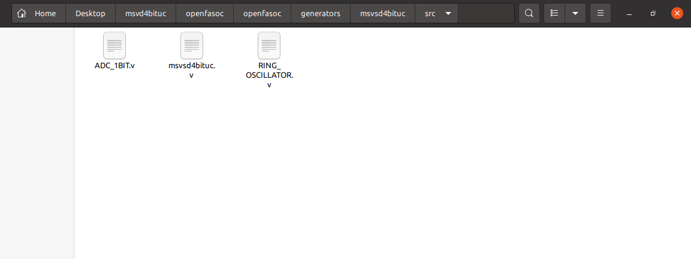
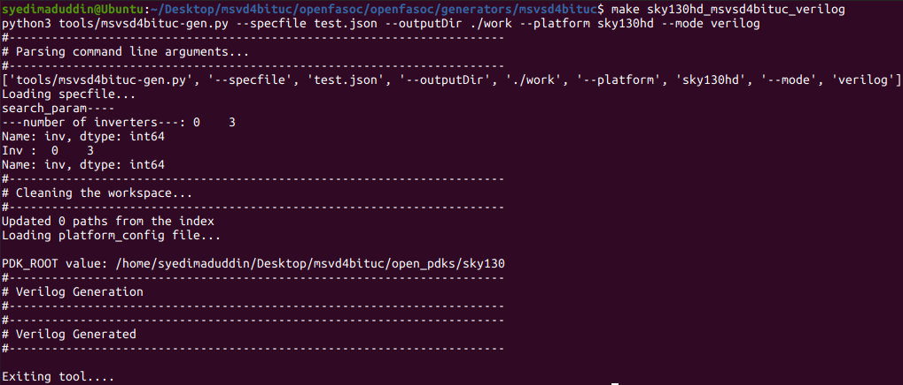
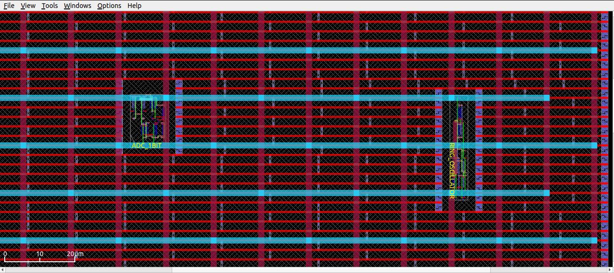

## Index

## OpenFASoC Flow
For OpenFASoC flow go to openfasoc install directory ```~/openfasoc/openfasoc/generators ``` create a folder ```msvsd4bituc```.


Inside the ```msvsd4bituc``` there are many files and folders.


Top level Makefile 

```bash
# ==============================================================================
# Run msvsd4bituc design
# ==============================================================================

sky130hd_msvsd4bituc_verilog:
	python3 tools/msvsd4bituc-gen.py --specfile test.json --outputDir ./work --platform sky130hd --mode verilog

sky130hd_msvsd4bituc:
	python3 tools/msvsd4bituc-gen.py --specfile test.json --outputDir ./work --platform sky130hd --mode macro
	@python3 tools/parse_rpt.py
	@tools/verify_op.sh
	@@echo "=================================================================================="
	@@echo "Thank you for using OpenFASOC"
	@@echo "For more info, please read the latest documentation on openfasoc.readthedocs.io"
	@@echo "For any issues, please feel free to open an issue on GitHub repository"
	@@echo "=================================================================================="
	
sky130hd_msvsd4bituc_full:
	# add --pex to also run pex simulations
	python3 tools/msvsd4bituc-gen.py --specfile test.json --outputDir ./work --platform sky130hd --mode full --prepex
	@python3 tools/parse_rpt.py
	@tools/verify_op.sh

clean:
	rm -f error_within_x.csv golden_error_opt.csv search_result.csv
	rm -rf work
	rm -rf tools/*.pyc tools/__pycache__/
	cd flow && make clean_all
	cd simulations && rm -rf run

banner:
	@@echo "=============================================================="
	@@echo "   ___  _____ ______ _   _ _____  _     ____   ___   ____"
	@@echo "  / _ \|  _  \| ____| \ | |  ___|/ \   / ___| / _ \ / ___|"
	@@echo " | | | | |_) ||  _| |  \| | |_  / _ \  \___ \| | | | |    "
	@@echo " | |_| |  __/ | |___| |\  |  _|/ ___ \  ___) | |_| | |___ "
	@@echo "  \___/|_|    |_____|_| \_|_| /_/   \_\|____/ \___/ \____|"
	@@echo ""
	@@echo "==============================================================="
```

Go to ```/src/``` and place your dummy verilog code.


#### Dummy Verilog For Top level
```verilog
module msvsd4bituc(
    input VDD,
    input VSS,
    input INN,
    output OUT
);

wire ring_adc;

RING_OSCILLATOR RING_OSCILLATOR (
    .INP(ring_adc)
);

ADC_1BIT ADC_1BIT (
    .OUT(OUT),
    .INN(INN),
    .INP(ring_adc)
);

endmodule
```

#### Verilog code for Ring Oscillator
```verilog
module RING_OSCILLATOR(
	output INP
);

endmodule
```

#### Verilog code for 1-bit ADC
```verilog
module ADC_1BIT(
	output OUT,
	input INN,
	input INP
);

endmodule
```

content of the ```/tools/``` Directory


### Verilog Genertion
For our Simple design Verilog generation is just copying the verilog file 

```python
print("#----------------------------------------------------------------------")
print("# Verilog Generation")
print("#----------------------------------------------------------------------")

if args.platform == "sky130hd":
    aux1 = "RING_OSCILLATOR"
    aux2 = "ADC_1BIT"
elif args.platform == "sky130hs":
    aux1 = "RING_OSCILLATOR_hs"
    aux2 = "ADC_1BIT_hs"

with open(srcDir + "/msvsd4bituc.v", "r") as file:
    filedata = file.read()
if args.mode == "verilog":
    with open(flowDir+ "design/src/msvsd4bituc/msvsd4bituc.v", "w") as file:
        file.write(filedata)

with open(srcDir + "/RING_OSCILLATOR.v", "r") as file:
    filedata = file.read()
if args.mode == "verilog":
    with open(flowDir+ "design/src/msvsd4bituc/RING_OSCILLATOR.v", "w") as file:
        file.write(filedata)

with open(srcDir + "/ADC_1BIT.v", "r") as file:
    filedata = file.read()
if args.mode == "verilog":
    with open(flowDir+ "design/src/msvsd4bituc/ADC_1BIT.v", "w") as file:
        file.write(filedata)
	
print("# msvsd4bituc - Behavioural Verilog Generated")
print("#----------------------------------------------------------------------")
print("# Verilog Generated")
print("#----------------------------------------------------------------------")
print()
if args.mode == "verilog":
    print("Exiting tool....")
    exit()
```

To view the complete ```msvsd4bituc-gen.py``` file, Click Here👇
<details><summary>Netlist</summary>

```python
#!/usr/bin/python3

import json
import os
import re
import shutil
import subprocess as sp
import sys
import time

from parameter import args, main, designName

genDir = os.path.join(os.path.dirname(os.path.relpath(__file__)), "../")
srcDir = genDir + "src/"
flowDir = genDir + "flow/"
designDir = genDir + "designs/src/msvsd4bituc/"
simDir = genDir + "simulations/"
commonDir = genDir + "../../common/"
platformDir = genDir + "../../common/platforms/" + args.platform + "/"
objDir = flowDir + "objects/" + args.platform + "/msvsd4bituc/"

# ------------------------------------------------------------------------------
# Clean the workspace
# ------------------------------------------------------------------------------
print("#----------------------------------------------------------------------")
print("# Cleaning the workspace...")
print("#----------------------------------------------------------------------")
if args.clean:
    p = sp.Popen(["make", "clean_all"], cwd=genDir)
    p.wait()

p = sp.Popen(["git", "checkout", platformDir + "cdl/sky130_fd_sc_hd.spice"])
p.wait()

print("Loading platform_config file...")
print()
try:
    with open(genDir + "../../common/platform_config.json") as file:
        jsonConfig = json.load(file)
except ValueError as e:
    print("Error occurred opening or loading json file.")
    print >> sys.stderr, "Exception: %s" % str(e)
    sys.exit(1)
    
PDK_ROOT = "/home/syedimaduddin/Desktop/msvd4bituc/open_pdks/sky130"

print("PDK_ROOT value: {}".format(PDK_ROOT))

# TODO: GHA/GCP/Whatever check
pdk = None
if PDK_ROOT is not None:
    pdk = os.path.join(PDK_ROOT, "sky130A")
else:
    open_pdks_key = "open_pdks"
    pdk = jsonConfig[open_pdks_key]

if not os.path.isdir(os.path.join(pdk, "libs.ref")):
    print("Cannot find libs.ref folder from open_pdks in " + pdk)
    sys.exit(1)
elif not os.path.isdir(os.path.join(pdk, "libs.tech")):
    print("Cannot find libs.tech folder from open_pdks in " + pdk)
    sys.exit(1)
else:
    sky130A_path = commonDir + "drc-lvs-check/sky130A/"
    if not os.path.isdir(sky130A_path):
        os.mkdir(sky130A_path)
    try:
        sp.Popen(
            [
                "sed -i 's/set PDKPATH \".*/set PDKPATH $env(PDK_ROOT)\/sky130A/' {}/sky130A/libs.tech/magic/sky130A.magicrc".format(PDK_ROOT)
            ],
            shell=True,
        ).wait()
    except:
        pass
    shutil.copy2(os.path.join(pdk, "libs.tech/magic/sky130A.magicrc"), sky130A_path)
    shutil.copy2(os.path.join(pdk, "libs.tech/netgen/sky130A_setup.tcl"), sky130A_path)


Fmin, Fmax, ninv = main()

print("Inv : ", ninv)
print("INV:{0}\n".format(ninv))

if args.ninv:
    print("target number of inverters: " + args.ninv)
    ninv = int(args.ninv)

print("#----------------------------------------------------------------------")
print("# Verilog Generation")
print("#----------------------------------------------------------------------")

if args.platform == "sky130hd":
    aux1 = "RING_OSCILLATOR"
    aux2 = "ADC_1BIT"
elif args.platform == "sky130hs":
    aux1 = "RING_OSCILLATOR_hs"
    aux2 = "ADC_1BIT_hs"

with open(srcDir + "/msvsd4bituc.v", "r") as file:
    filedata = file.read()
if args.mode == "verilog":
    with open(flowDir+ "design/src/msvsd4bituc/msvsd4bituc.v", "w") as file:
        file.write(filedata)

with open(srcDir + "/RING_OSCILLATOR.v", "r") as file:
    filedata = file.read()
if args.mode == "verilog":
    with open(flowDir+ "design/src/msvsd4bituc/RING_OSCILLATOR.v", "w") as file:
        file.write(filedata)

with open(srcDir + "/ADC_1BIT.v", "r") as file:
    filedata = file.read()
if args.mode == "verilog":
    with open(flowDir+ "design/src/msvsd4bituc/ADC_1BIT.v", "w") as file:
        file.write(filedata)
        
print("# msvsd4bituc - Behavioural Verilog Generated")
print("#----------------------------------------------------------------------")
print("# Verilog Generated")
print("#----------------------------------------------------------------------")
print()
if args.mode == "verilog":
    print("Exiting tool....")
    exit()

print("#----------------------------------------------------------------------")
print("# Run Synthesis")
print("#----------------------------------------------------------------------")

p = sp.Popen(["make", "synth"], cwd=flowDir)
p.wait()
if p.returncode:
    print("[Error] Snthesis failed. Refer to the log file")
    exit(1)

print("#----------------------------------------------------------------------")
print("# Synthesis finished")
print("#----------------------------------------------------------------------")

print("#----------------------------------------------------------------------")
print("# Run Floorplan")
print("#----------------------------------------------------------------------")
p = sp.Popen(["make", "floorplan"], cwd=flowDir)
p.wait()
if p.returncode:
    print("[Error] Floorplan failed. Refer to the log file")
    exit(1)
print("#----------------------------------------------------------------------")
print("# Floorplan finished")
print("#----------------------------------------------------------------------")

print("#----------------------------------------------------------------------")
print("# Run Placement")
print("#----------------------------------------------------------------------")
p = sp.Popen(["make", "place"], cwd=flowDir)
p.wait()
if p.returncode:
    print("[Error] Placement failed. Refer to the log file")
    exit(1)
print("#----------------------------------------------------------------------")
print("# Placement finished")
print("#----------------------------------------------------------------------")

print("#----------------------------------------------------------------------")
print("# Run Routing")
print("#----------------------------------------------------------------------")
p = sp.Popen(["make", "finish"], cwd=flowDir)
p.wait()
if p.returncode:
    print("[Error] Place and route failed. Refer to the log file")
    exit(1)
print("#----------------------------------------------------------------------")
print("# Place and Route finished")
print("#----------------------------------------------------------------------")
```
</details>


### Synthesized Verilog Code
To create synthesized verilog run the following command in terminal inside ``` /generators/msvsd4bituc/ ``` folder.
```
make sky130hd_msvsd4bituc_verilog
```


Openfasoc generates synthesized Verilog code for openroad flow in ``` /flow/results/sky130hd/msvsd4bituc ```

```verilog
/* Generated by Yosys 0.26+39 (git sha1 f0116330b, clang 10.0.0-4ubuntu1 -fPIC -Os) */

module msvsd4bituc(VDD, VSS, INN, OUT);
  input INN;
  wire INN;
  output OUT;
  wire OUT;
  input VDD;
  wire VDD;
  input VSS;
  wire VSS;
  wire ring_adc;
  ADC_1BIT ADC_1BIT (
    .INN(INN),
    .INP(ring_adc),
    .OUT(OUT)
  );
  RING_OSCILLATOR RING_OSCILLATOR (
    .INP(ring_adc)
  );
endmodule
```

### Config.mk file
To view the config.mk file inside folder ``` /msvsd4bituc/flow/design/sky130hd/msvsd4bituc/ ```. Click Here👇
<details><summary>Netlist</summary>

``` bash
export DESIGN_NICKNAME = msvsd4bituc
export DESIGN_NAME = msvsd4bituc
export PLATFORM    = sky130hd

export VERILOG_FILES 		= $(sort $(wildcard ./design/src/$(DESIGN_NICKNAME)/*.v)) 
			  	  
export SDC_FILE    		= ./design/$(PLATFORM)/$(DESIGN_NICKNAME)/constraint.sdc

export DIE_AREA   	 	= 0 0 300 300
export CORE_AREA   		= 15 15 250 250

# area of the smaller voltage domain
export VD1_AREA                 = 50 50 100 150

# power delivery network config file
export PDN_TCL 			= ../blocks/$(PLATFORM)/pdn.tcl

export ADDITIONAL_LEFS  	= ../blocks/$(PLATFORM)/lef/RING_OSCILLATOR.lef \
                        	  ../blocks/$(PLATFORM)/lef/ADC_1BIT.lef
                        	  
export ADDITIONAL_GDS_FILES 	= ../blocks/$(PLATFORM)/gds/RING_OSCILLATOR.gds \
			      	  ../blocks/$(PLATFORM)/gds/ADC_1BIT.gds
			      	  
# informs what cells should be placed in the smaller voltage domain
export DOMAIN_INSTS_LIST 	= ../blocks/$(PLATFORM)/msvsd4bituc_domain_insts.txt

# configuration for placement

# don't run global place w/o IOs
export HAS_IO_CONSTRAINTS = 1

# don't run non-random IO placement (step 3_2)
export PLACE_PINS_ARGS = -random
export GPL_ROUTABILITY_DRIVEN = 1

# DPO optimization currently fails on the tempsense
export ENABLE_DPO = 0

# configuration for routing
export PRE_GLOBAL_ROUTE = $(SCRIPTS_DIR)/openfasoc/pre_global_route.tcl

# informs any short circuits that should be forced during routing
export CUSTOM_CONNECTION 	= ../blocks/$(PLATFORM)/msvsd4bituc_custom_net.txt

# indicates with how many connections the VIN route from the HEADER cells connects to the VIN power ring
export VIN_ROUTE_CONNECTION_POINTS = 2
```
</details>


### Run the flow by the following command 
```
 make sky130hd_msvsd4bituc
```
### Run Synthesis


### Run Floorplan


Design area 321 u^2 1% utilization.


### Placement


Design area 2274 u^2 4% utilization.


Placement in OpenROAD GUI



|ADC_1BIT|RING_OSCILLATOR|
|-|-|
|||

### Routing


### Final Files


### Error


<!--
### Global Route


### Final layout 


### Connection


### Final Files


### Error


## Only The GDS File part is left.
I face this problem because the hierarchy of lef and gds file(ALIGN FLOW)

## OpenROAD


<!-- 
|.gds|.lef|
|-|-|
|| |

For view The Full Netlist Here👇
<details><summary>Netlist</summary>

```

```
</details>
<br> -->
