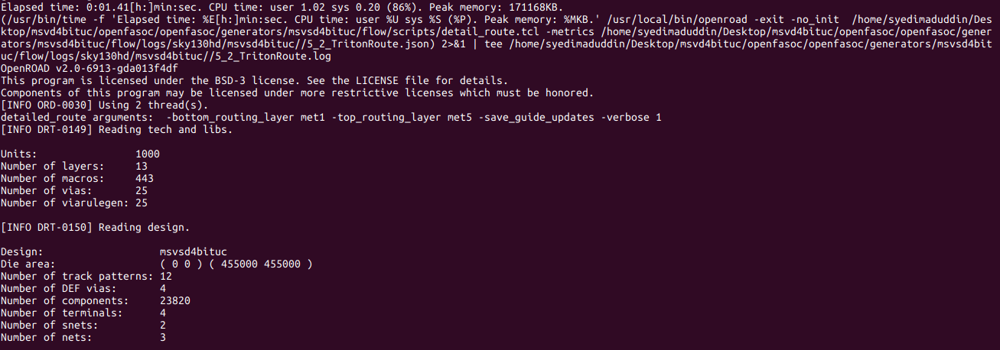

## Index

## OpenFASoC Flow
For OpenFASoC flow go to openfasoc install directory ```~/openfasoc/openfasoc/generators ``` create a folder ```msvsd4bituc```.


Inside the ```msvsd4bituc``` there are many files and folders.


Top level Makefile 

```bash
# ==============================================================================
# Run msvsd4bituc design
# ==============================================================================

sky130hd_msvsd4bituc_verilog:
	python3 tools/msvsd4bituc-gen.py --specfile test.json --outputDir ./work --platform sky130hd --mode verilog

sky130hd_msvsd4bituc:
	python3 tools/msvsd4bituc-gen.py --specfile test.json --outputDir ./work --platform sky130hd --mode full
	@python3 tools/parse_rpt.py
	@@echo "=================================================================================="
	@@echo "Thank you for using OpenFASOC"
	@@echo "For more info, please read the latest documentation on openfasoc.readthedocs.io"
	@@echo "For any issues, please feel free to open an issue on GitHub repository"
	@@echo "=================================================================================="
	@@echo "   ___  _____ ______ _   _ _____  _     ____   ___   ____"
	@@echo "  / _ \|  _  \| ____| \ | |  ___|/ \   / ___| / _ \ / ___|"
	@@echo " | | | | |_) ||  _| |  \| | |_  / _ \  \___ \| | | | |    "
	@@echo " | |_| |  __/ | |___| |\  |  _|/ ___ \  ___) | |_| | |___ "
	@@echo "  \___/|_|    |_____|_| \_|_| /_/   \_\|____/ \___/ \____|"
	@@echo ""
	@@echo "=================================================================================="
	
clean:
	rm -f error_within_x.csv golden_error_opt.csv search_result.csv
	rm -rf work
	rm -rf tools/*.pyc tools/__pycache__/
	cd flow && make clean_all
	cd simulations && rm -rf run
```

Go to ```/src/``` and place your dummy verilog code.


#### Dummy Verilog For Top level
```verilog
module msvsd4bituc(
    input VDD,
    input VSS,
    input INN,
    output OUT
);

wire ring_adc;

RING_OSCILLATOR RING_OSCILLATOR (
    .INP(ring_adc)
);

ADC_1BIT ADC_1BIT (
    .OUT(OUT),
    .INN(INN),
    .INP(ring_adc)
);

endmodule
```

#### Verilog code for Ring Oscillator
```verilog
module RING_OSCILLATOR(
	output INP
);

endmodule
```

#### Verilog code for 1-bit ADC
```verilog
module ADC_1BIT(
	output OUT,
	input INN,
	input INP
);

endmodule
```

content of the ```/tools/``` Directory


### Verilog Genertion
For our Simple design Verilog generation is just copying the verilog file 

```python
print("#----------------------------------------------------------------------")
print("# Verilog Generation")
print("#----------------------------------------------------------------------")


if args.platform == "sky130hd":
    aux1 = "RING_OSCILLATOR"
    aux2 = "ADC_1BIT"
elif args.platform == "sky130hs":
    aux1 = "RING_OSCILLATOR_hs"
    aux2 = "ADC_1BIT_hs"

shutil.copyfile(srcDir + "msvsd4bituc.v", flowDir + "design/src/msvsd4bituc/msvsd4bituc" + ".v")
shutil.copyfile(srcDir + "RING_OSCILLATOR.v", flowDir + "design/src/msvsd4bituc/RING_OSCILLATOR" + ".v")
shutil.copyfile(srcDir + "ADC_1BIT.v", flowDir + "design/src/msvsd4bituc/ADC_1BIT" + ".v")

        
print("#----------------------------------------------------------------------")
print("# Verilog Generated")
print("#----------------------------------------------------------------------")
print()
if args.mode == "verilog":
    print("Exiting tool....")
    exit()
```

### Synthesized Verilog Code
To create synthesized verilog run the following command in terminal inside ``` /generators/msvsd4bituc/ ``` folder.
```
make sky130hd_msvsd4bituc_verilog
```


Openfasoc generates synthesized Verilog code for openroad flow in ``` /flow/results/sky130hd/msvsd4bituc ```

```verilog
/* Generated by Yosys 0.26+39 (git sha1 f0116330b, clang 10.0.0-4ubuntu1 -fPIC -Os) */

module msvsd4bituc(VDD, VSS, INN, OUT);
  input INN;
  wire INN;
  output OUT;
  wire OUT;
  input VDD;
  wire VDD;
  input VSS;
  wire VSS;
  wire ring_adc;
  ADC_1BIT ADC_1BIT (
    .INN(INN),
    .INP(ring_adc),
    .OUT(OUT)
  );
  RING_OSCILLATOR RING_OSCILLATOR (
    .INP(ring_adc)
  );
endmodule
```

### Config.mk file
To view the config.mk file inside folder ``` /msvsd4bituc/flow/design/sky130hd/msvsd4bituc/ ```. Click Here👇
<details><summary>Netlist</summary>

``` bash
export DESIGN_NICKNAME = msvsd4bituc
export DESIGN_NAME = msvsd4bituc
export PLATFORM    = sky130hd

export VERILOG_FILES 		= $(sort $(wildcard ./design/src/$(DESIGN_NICKNAME)/*.v)) 
			  	  
export SDC_FILE    		= ./design/$(PLATFORM)/$(DESIGN_NICKNAME)/constraint.sdc

export DIE_AREA   	 	= 0 0 300 300
export CORE_AREA   		= 15 15 250 250

# area of the smaller voltage domain
#export VD1_AREA                 = 50 50 100 150

# power delivery network config file
export PDN_TCL 			= ../blocks/$(PLATFORM)/pdn.tcl

export ADDITIONAL_LEFS  	= ../blocks/$(PLATFORM)/lef/RING_OSCILLATOR.lef \
                        	  ../blocks/$(PLATFORM)/lef/ADC_1BIT.lef
                        	  
export ADDITIONAL_GDS_FILES 	= ../blocks/$(PLATFORM)/gds/RING_OSCILLATOR.gds \
			      	  ../blocks/$(PLATFORM)/gds/ADC_1BIT.gds
			      	  
# informs what cells should be placed in the smaller voltage domain
export DOMAIN_INSTS_LIST 	= ../blocks/$(PLATFORM)/msvsd4bituc_domain_insts.txt

# configuration for placement

# don't run global place w/o IOs
#export HAS_IO_CONSTRAINTS = 1
# don't run non-random IO placement (step 3_2)
export PLACE_PINS_ARGS = -random

export GPL_ROUTABILITY_DRIVEN = 1

# DPO optimization currently fails on the tempsense
export ENABLE_DPO = 0

#export CELL_PAD_IN_SITES_GLOBAL_PLACEMENT = 4
#export CELL_PAD_IN_SITES_DETAIL_PLACEMENT = 2

# configuration for routing

#export PRE_GLOBAL_ROUTE = $(SCRIPTS_DIR)/openfasoc/pre_global_route.tcl

# informs any short circuits that should be forced during routing
export CUSTOM_CONNECTION 	= ../blocks/$(PLATFORM)/msvsd4bituc_custom_net.txt

# indicates with how many connections the VIN route from the HEADER cells connects to the VIN power ring
#export VIN_ROUTE_CONNECTION_POINTS = 3
```
</details>


### Run the flow by the following command 
```
 make sky130hd_msvsd4bituc
```
### Run Synthesis


### Run Floorplan
Design area 321 u^2 1% utilization.


### Global Place
Design area 2274 u^2 4% utilization.


Placement in OpenROAD GUI


|ADC_1BIT|RING_OSCILLATOR|
|-|-|
|||

### Global Route



### Place and Route


### DRC Check


### Final Files


<!--

### Final layout 


### Connection


## OpenROAD


 -->
