## Index
- [Reduction of Area](https://github.com/syedimaduddin/msvsd4bituc/blob/main/Week-7/README.md#reduction-of-area)
    * [Changes Made](https://github.com/syedimaduddin/msvsd4bituc/blob/main/Week-7/README.md#changes-made)
    * [Run Synthesis](https://github.com/syedimaduddin/msvsd4bituc/blob/main/Week-7/README.md#run-synthesis)
    * [Run Floorplan](https://github.com/syedimaduddin/msvsd4bituc/blob/main/Week-7/README.md#run-floorplan)
    * [Global Place](https://github.com/syedimaduddin/msvsd4bituc/blob/main/Week-7/README.md#global-place)
    * [Global Route](https://github.com/syedimaduddin/msvsd4bituc/blob/main/Week-7/README.md#global-route)
    * [Check Antennas](https://github.com/syedimaduddin/msvsd4bituc/blob/main/Week-7/README.md#check-antennas)
    * [DRC Check](https://github.com/syedimaduddin/msvsd4bituc/blob/main/Week-7/README.md#drc-check)
    * [GDS in Magic](https://github.com/syedimaduddin/msvsd4bituc/blob/main/Week-7/README.md#gds-file-in-magic)
    * [GDS in KLayout](https://github.com/syedimaduddin/msvsd4bituc/blob/main/Week-7/README.md#gds-file-in-klayout)
- [Connection of VSS and VDD](https://github.com/syedimaduddin/msvsd4bituc/blob/main/Week-7/README.md#connection-of-vss-and-vdd)
    * [Changes in pdn.tcl](https://github.com/syedimaduddin/msvsd4bituc/blob/main/Week-7/README.md#pdntcl)
    * [Changes in manual_macro.tcl](https://github.com/syedimaduddin/msvsd4bituc/blob/main/Week-7/README.md#manual_macrotcl)
    * [Changes in msvsd4bituc_VSS_connection.txt](https://github.com/syedimaduddin/msvsd4bituc/blob/main/Week-7/README.md#msvsd4bituc_vss_connectiontxt)
    * [Changes in msvsd4bituc_VDD_connection.txt](https://github.com/syedimaduddin/msvsd4bituc/blob/main/Week-7/README.md#msvsd4bituc_vdd_connectiontxt)
    * [Changes in msvsd4bituc_domain_insts.txt](https://github.com/syedimaduddin/msvsd4bituc/blob/main/Week-7/README.md#msvsd4bituc_domain_inststxt)
    * [Changes in pre_global_route.tcl](https://github.com/syedimaduddin/msvsd4bituc/blob/main/Week-7/README.md#pre_global_routetcl)
    * [Changes in add_ndr_rules.tcl](https://github.com/syedimaduddin/msvsd4bituc/blob/main/Week-7/README.md#add_ndr_rulestcl)
    * [Changes in config.mk](https://github.com/syedimaduddin/msvsd4bituc/blob/main/Week-7/README.md#configmk)
    * [DRC Check after VDD and VSS Connections](https://github.com/syedimaduddin/msvsd4bituc/blob/main/Week-7/README.md#drc-check-after-vdd-and-vss-connections)
    * [GDS after VDD and VSS Connections in Magic](https://github.com/syedimaduddin/msvsd4bituc/blob/main/Week-7/README.md#gds-file-with-vdd-and-vss-connections-in-magic)
    * [GDS after VDD and VSS Connections in KLayout](https://github.com/syedimaduddin/msvsd4bituc/blob/main/Week-7/README.md#gds-file-with-vdd-and-vss-connections-in-klayout)
- [Conclusion](https://github.com/syedimaduddin/msvsd4bituc/blob/main/Week-7/README.md#conclusion)

    
## Reduction of Area

#### Changes Made
Firsly, I have made my gds files imported in magic to be placed at (0,0) point, as given in below image.
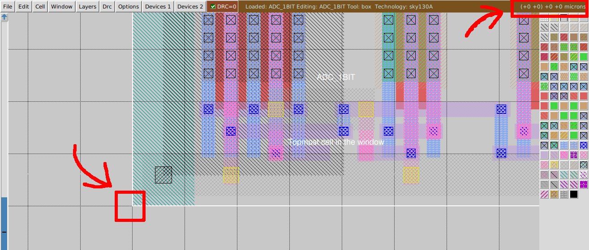

I have reduced the area by creating a ```manual_macro.tcl``` file and given the following values into it.

```
RING_OSCILLATOR N 20 20
ADC_1BIT N 60 20
```

And also made some changes in my config.mk file, new values in config.mk file is given below.

```bash
export DESIGN_NICKNAME = msvsd4bituc
export DESIGN_NAME = msvsd4bituc
export PLATFORM    = sky130hd

export VERILOG_FILES 		= $(sort $(wildcard ./design/src/$(DESIGN_NICKNAME)/*.v)) 
			  	  
export SDC_FILE    		= ./design/$(PLATFORM)/$(DESIGN_NICKNAME)/constraint.sdc

export DIE_AREA   	 	= 0 0 100 60
export CORE_AREA   		= 10 10 90 50

# area of the smaller voltage domain
#export VD1_AREA                 = 50 50 100 150

# power delivery network config file
export PDN_TCL 			= ../blocks/$(PLATFORM)/pdn.tcl

export ADDITIONAL_LEFS  	= ../blocks/$(PLATFORM)/lef/RING_OSCILLATOR.lef \
                        	  ../blocks/$(PLATFORM)/lef/ADC_1BIT.lef
                        	  
export ADDITIONAL_GDS_FILES 	= ../blocks/$(PLATFORM)/gds/RING_OSCILLATOR.gds \
			      	  ../blocks/$(PLATFORM)/gds/ADC_1BIT.gds
			      	  
# informs what cells should be placed in the smaller voltage domain
export DOMAIN_INSTS_LIST 	= ../blocks/$(PLATFORM)/msvsd4bituc_domain_insts.txt

# configuration for placement
export MACRO_PLACE_HALO         = 1 1
export MACRO_PLACE_CHANNEL      = 30 30
export MACRO_PLACEMENT          = ../blocks/$(PLATFORM)/manual_macro.tcl


# don't run global place w/o IOs
#export HAS_IO_CONSTRAINTS = 1
# don't run non-random IO placement (step 3_2)
export PLACE_PINS_ARGS = -random

export GPL_ROUTABILITY_DRIVEN = 1

# DPO optimization currently fails on the tempsense
export ENABLE_DPO = 0

#export CELL_PAD_IN_SITES_GLOBAL_PLACEMENT = 4
#export CELL_PAD_IN_SITES_DETAIL_PLACEMENT = 2

# configuration for routing

# export PRE_GLOBAL_ROUTE = $(SCRIPTS_DIR)/openfasoc/pre_global_route.tcl

# informs any short circuits that should be forced during routing
export CUSTOM_CONNECTION 	= ../blocks/$(PLATFORM)/msvsd4bituc_custom_net.txt

# indicates with how many connections the VIN route from the HEADER cells connects to the VIN power ring
export VIN_ROUTE_CONNECTION_POINTS = 3
```

#### Run Synthesis
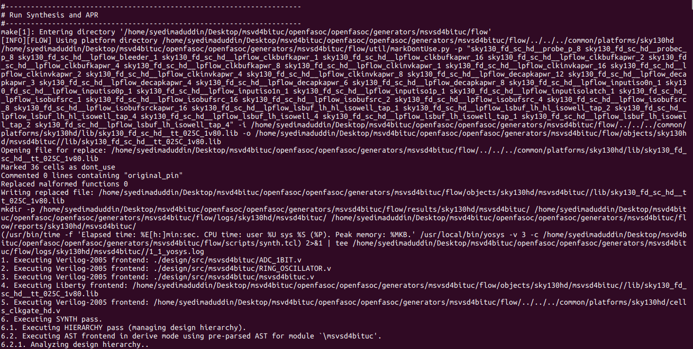

#### Run Floorplan
Design area 409 u^2 13% utilization.
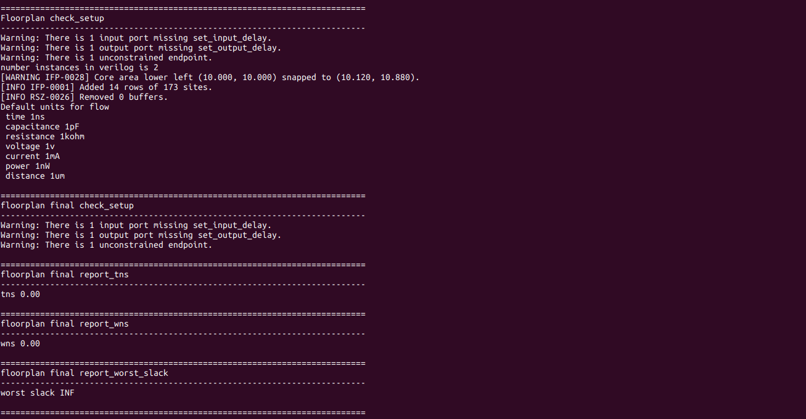
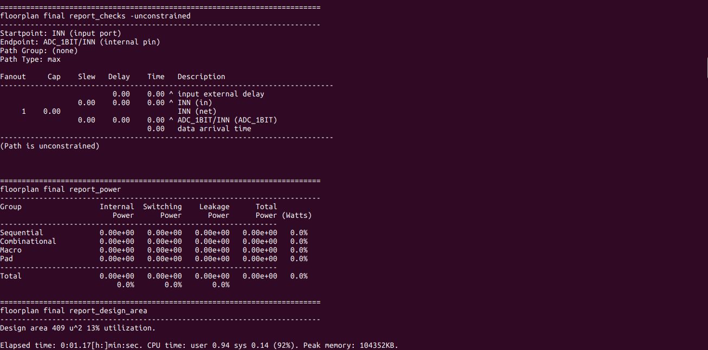

#### Global Place
Design area 746 u^2 25% utilization.
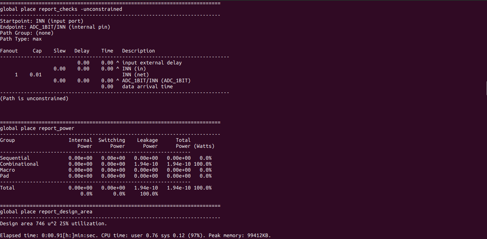
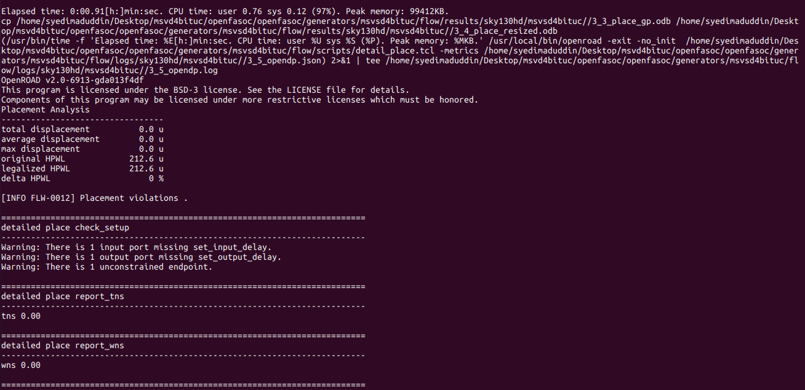

#### Global Route
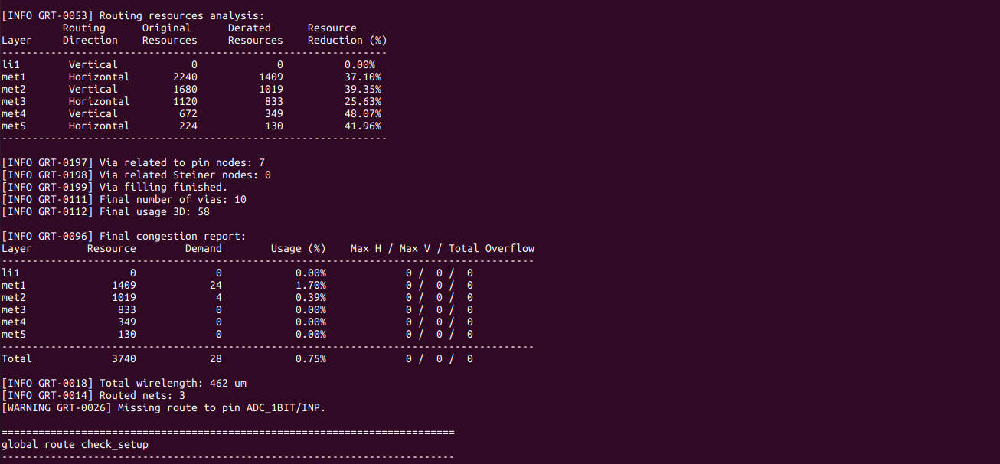

#### Check Antennas
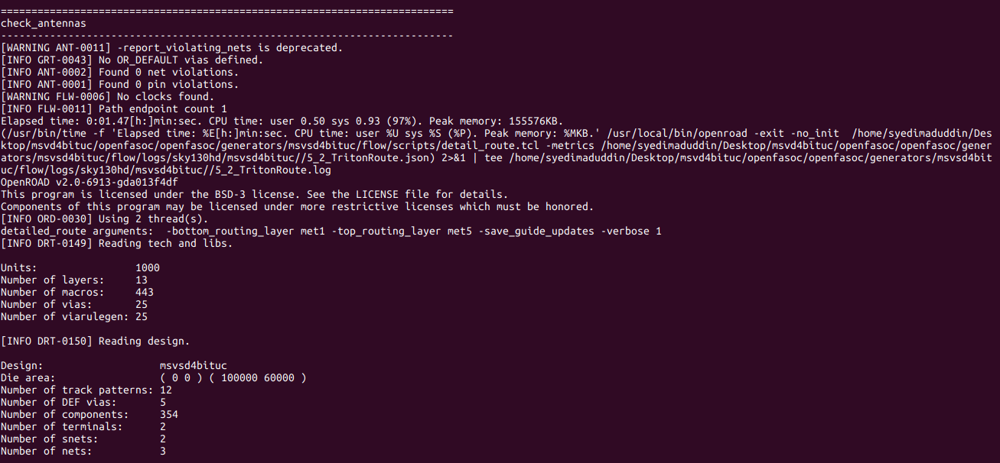

#### DRC Check
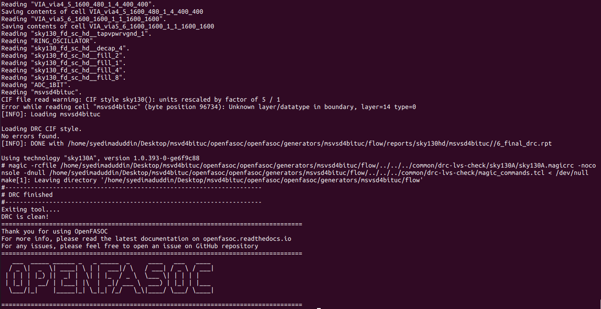

#### GDS File in Magic
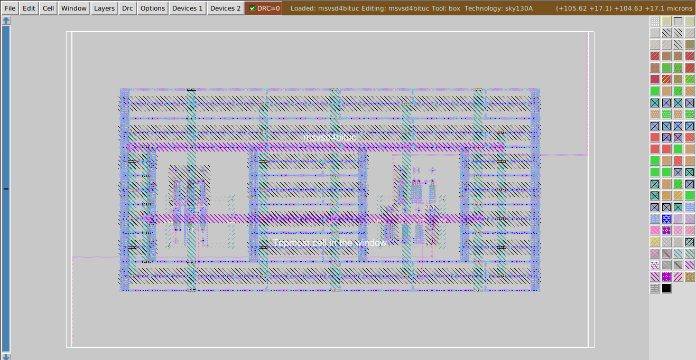

#### GDS File in KLayout
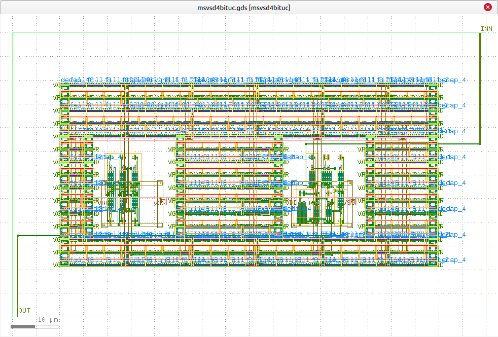

## Connection of VSS and VDD
It is necessary to manually edit many files in order to set up the routable nets so power and ground pins can be connected to the macro. These include ```pdn.tcl```, ```config.mk```, ```pre_global_route.tcl```, as well as 2 new files for creating custom connections to the macro power and ground lines ```msvsd4bituc_VSS_connection.txt``` and ```msvsd4bituc_VDD_connection.txt```, and some changes in ```msvsd4bituc_domain_insts.txt```. The ```manual_macro.tcl``` script is needed for setting macro positions and fine-tuning if unwanted DRC errors occur. In order to add VDD and VSS custom routings correctly, ```add_ndr_rules.tcl``` must also be edited.

Here is a brief explanation of the files mentioned above.

#### pdn.tcl

Location of file inside msvsd4bituc folder -> ./blocks/sky130hd/pdn.tcl
```bash
####################################
# global connections
####################################
add_global_connection -net VDD -inst_pattern {.*} -pin_pattern {VPWR|VPB} -power ; # default: VDD as power
add_global_connection -net VSS -inst_pattern {.*} -pin_pattern {VGND|VNB} -ground
global_connect

####################################
# voltage domains
####################################
set_voltage_domain -name {CORE} -power {VDD} -ground {VSS}

####################################
# standard cell grid
####################################
define_pdn_grid -name stdcell -pins met5 -starts_with POWER -voltage_domains CORE

## horizontal lines-----
add_pdn_stripe -grid {stdcell} -layer {met1} -width {0.48} -pitch {5} -offset {2.0} -extend_to_core_ring -followpins
add_pdn_ring -grid stdcell -layer {met4 met5} -widths {5.0 5.0} -spacings {2.0 2.0} -core_offsets {1.0 1.0}

##----vertical lines
add_pdn_stripe -grid {stdcell} -layer {met4} -width {0.48} -pitch {30} -offset {0.5} -extend_to_core_ring
add_pdn_connect -grid {stdcell} -layers {met1 met4}
add_pdn_connect -grid {stdcell} -layers {met4 met5}
```

```add_pdn_ring``` is used to define a ring for delivering power an gnd to the core which is also used by the macros, so extra power domains is not necessary in this case. For adding horizontal connections between filler and tapcells, the following stripe definitions is needed and horizontal is actually differentiated by ```-followpins```. For adding vertical connections between filler and tapcells, the stripe definitions is needed. Here the vertical layers is using metal4 so is defined, here -pitch {30} defines the distance between consecutive power and gnd lines.(Note: if facing drc errors manually adjust the pitch and offset values).

#### manual_macro.tcl

Location of file inside msvsd4bituc folder -> ./blocks/sky130hd/manual_macro.tcl
```bash
RING_OSCILLATOR N 35 30
ADC_1BIT N 75 30
```

#### msvsd4bituc_VSS_connection.txt

Location of file inside msvsd4bituc folder -> ./blocks/sky130hd/msvsd4bituc_VSS_connection.txt

This file has the definitions for the macro ground nets
```bash
r_VSS
RING_OSCILLATOR VSS
ADC_1BIT VSS
```

#### msvsd4bituc_VDD_connection.txt

Location of file inside msvsd4bituc folder -> ./blocks/sky130hd/msvsd4bituc_VDD_connection.txt

This file has the definitions for the macro power nets
```bash
r_VDD
RING_OSCILLATOR VDD
ADC_1BIT VDD
```

#### msvsd4bituc_domain_insts.txt

Location of file inside msvsd4bituc folder -> ./blocks/sky130hd/msvsd4bituc_domain_insts.txt

One more important bit is to set the correct name of the name of the instance used while defining in the dummy verilog files, like if RING_OSCILLATOR was defined as RING_OSCILLATOR RING_OSCILLATOR(....) the msvsd4bituc_domain_insts.txt also need to have the same user-defined name- RING_OSCILLATOR. the file contents are below
```bash
RING_OSCILLATOR
ADC_1BIT
```

#### pre_global_route.tcl

Location of file inside msvsd4bituc folder -> ./flow/scripts/openfasoc/pre_global_route.tcl
```bash
# Create r_VIN net
source $::env(SCRIPTS_DIR)/openfasoc/create_routable_power_net.tcl
create_routable_power_net "VSS" $::env(VIN_ROUTE_CONNECTION_POINTS)
create_routable_power_net "VDD" $::env(VIN_ROUTE_CONNECTION_POINTS)

# NDR rules
source $::env(SCRIPTS_DIR)/openfasoc/add_ndr_rules.tcl

# Custom connections
source $::env(SCRIPTS_DIR)/openfasoc/create_custom_connections.tcl
if {[info exist ::env(VSS_VSS_CONNECTION)]} {
  create_custom_connections $::env(VSS_VSS_CONNECTION)
}
if {[info exist ::env(VDD_VDD_CONNECTION)]} {
  create_custom_connections $::env(VDD_VDD_CONNECTION)
}
```

Here create_custom_connections is used to define the vdd and vss connections we defined earlier.

#### add_ndr_rules.tcl

Location of file inside msvsd4bituc folder -> ./flow/scripts/openfasoc/add_ndr_rules.tcl

This file needs editing and although not that critical, it ensures that the certain routing rules are followed for routing the power and vss.
```bash
set block [ord::get_db_block]

# Add 2W, 2S rule to ring oscillator input
create_ndr -name NDR_5W_5S \
           -spacing { *5 } \
           -width { *5 }

set ndr [$block findNonDefaultRule NDR_5W_5S]
$ndr setHardSpacing 1

assign_ndr -ndr NDR_5W_5S -net VSS
assign_ndr -ndr NDR_5W_5S -net VDD
```

#### config.mk

Location of file inside msvsd4bituc folder -> ./flow/design/sky130hd/msvsd4bituc/config.mk
```bash
export DESIGN_NICKNAME = msvsd4bituc
export DESIGN_NAME = msvsd4bituc
export PLATFORM    = sky130hd

export VERILOG_FILES 		= $(sort $(wildcard ./design/src/$(DESIGN_NICKNAME)/*.v)) 		  	  
export SDC_FILE    		= ./design/$(PLATFORM)/$(DESIGN_NICKNAME)/constraint.sdc

export DIE_AREA   	 	= 0 0 120 90
export CORE_AREA   		= 25 23 100 65

# power delivery network config file
export PDN_TCL 			= ../blocks/$(PLATFORM)/pdn.tcl

export ADDITIONAL_LEFS  	= ../blocks/$(PLATFORM)/lef/RING_OSCILLATOR.lef \
                        	  ../blocks/$(PLATFORM)/lef/ADC_1BIT.lef
                        	  
export ADDITIONAL_GDS_FILES 	= ../blocks/$(PLATFORM)/gds/RING_OSCILLATOR.gds \
			      	  ../blocks/$(PLATFORM)/gds/ADC_1BIT.gds
			      	  
# informs what cells should be placed in the smaller voltage domain
export DOMAIN_INSTS_LIST 	= ../blocks/$(PLATFORM)/msvsd4bituc_domain_insts.txt
			      	  
# configuration for placement
export MACRO_PLACE_HALO         = 1 1
export MACRO_PLACE_CHANNEL      = 30 30
export MACRO_PLACEMENT          = ../blocks/$(PLATFORM)/manual_macro.tcl

# don't run global place w/o IOs
export HAS_IO_CONSTRAINTS = 1
# don't run non-random IO placement (step 3_2)
export PLACE_PINS_ARGS = -random

export GPL_ROUTABILITY_DRIVEN = 1

# DPO optimization currently fails on the tempsense
export ENABLE_DPO = 0

# configuration for routing
export PRE_GLOBAL_ROUTE = $(SCRIPTS_DIR)/openfasoc/pre_global_route.tcl

# informs any short circuits that should be forced during routing
export VSS_VSS_CONNECTION 	= ../blocks/$(PLATFORM)/msvsd4bituc_VSS_connection.txt
export VDD_VDD_CONNECTION 	= ../blocks/$(PLATFORM)/msvsd4bituc_VDD_connection.txt

# don't run non-random IO placement (step 3_2)
export PLACE_PINS_ARGS = -random
export GPL_ROUTABILITY_DRIVEN = 1

# DPO optimization currently fails on the msvsd4bituc
export ENABLE_DPO = 0

# indicates with how many connections the VIN route connects to the VIN power ring
export VIN_ROUTE_CONNECTION_POINTS = 3
```

#### DRC Check after VDD and VSS Connections
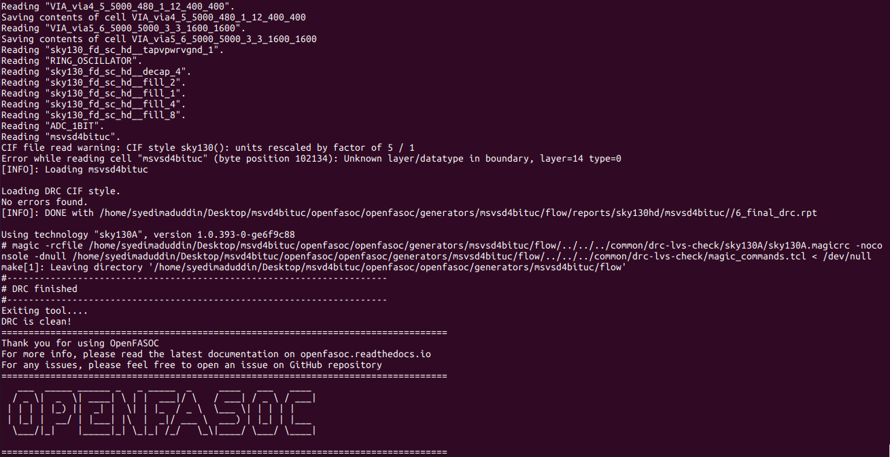

#### GDS File with VDD and VSS Connections in Magic
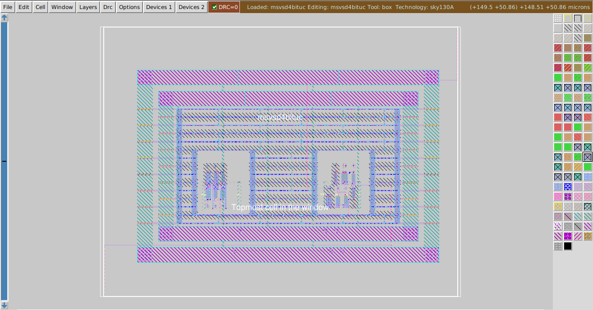

#### GDS File with VDD and VSS Connections in KLayout
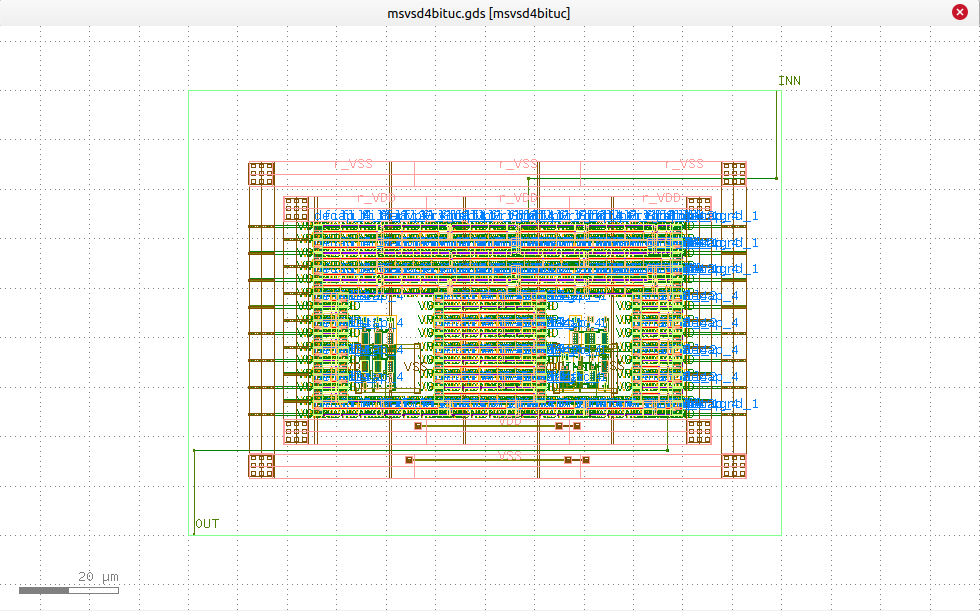

## Conclusion
The area is successfully reduced along with DRC clean, and VDD and VSS connections are made as well.
